# HTML与CSS复习/总结


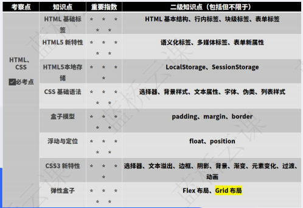


**需要掌握的程度：**

入职前端：`flex`必须会`grid`知道基本的就行，注重知识的广度，了解新API

蓝桥杯：了解基本标签，`flex`与`grid`知道基本的属性，`css`练到一定速度。（题型：修正布局、快速实现原型图按还原比例给分，对css要求不高，题也较少）

后端：了解基本标签，了解基本`css`属性，了解基本布局的实现，会用elementUI等组件库


**教学目标**

通过对常用以及重点知识点的做不止于基础的讲解，为之后的练习建立良好的认知，并且提供需要重点掌握的例子与例题。

**听**：理解知识点，我能帮到你的就是指出重点、学习路线，这一步其实学不会什么，重要的是听完再写时不会太蒙。

**练**：自己找东西去写，我的例题，跟写网上的实战等等，这完全就是看自己了。

web蓝桥杯的题都是场景题，也就是会给你基础的代码，在此之上完成题目，所以非重点的东西咱们了解即可，不必非得自己会默写。

**光听不练** => 了解知识但啥也做不出来

**光练不听** => 时间都花在debug上 强行理解和背诵 脑子容易爆炸

**不听不练** => 尊重每个人对时间的抉择，时间用来学习未必就是最高尚的


## 基本标签

- 万能标签：`<div>`
- 专用于正文文本段落：`<p>` `<span>`
- 加粗、斜体、下划线、删除线：`<b>` `<i>` `<u>` `<s>` （`bold` `italic` `underline` `strikethrough`，其实这四个我就没用过。但是看见得知道意思）
- 超文本链接：`<a>`
- 专用于标题文本:`<h1>` ` <h2>` ` <h3>`  `<h4>`  `<h5>`  `<h6>` `<h1>`分别代表不同等级的标题
- 列表：`<ul>`代表有序列表，`<ol>`代表无序列表，每个`<ol>`与`<ul>`应当包含若干个`<li>`标签，`<li>`代表列表中的每一项内容
- 表格`<table>`在最外层，`<thead>`为表头，`<tbody>`为表体。每个表头和表体都可以包含任意份 `<tr>`，表头的`<tr>`中包含若干个`<th>`，表体的`<tr>`中包含若干个`<td>`


## 多媒体标签

### img ：`src` `alt（重要）` ` title`

``

> alt是` ` 的特有属性，是图片内容的等价描述，用于图片无法加载时显示、读屏器阅读图片。可提图片高可访问性，除了纯装
>  饰图片外都必须设置有意义的值，搜索引擎会重点分析。


###  `svg `引入矢量图片

`svg`指定颜色用`fill`不用`color`。

```html
<svg t="1706364647319" class="icon" viewBox="0 0 1024 1024" version="1.1" xmlns="http://www.w3.org/2000/svg" p-id="4224" width="200" height="200">
    <path d="M874.666667 855.744a19.093333 19.093333 0 0 1-19.136 18.922667H168.469333A19.2 19.2 0 0 1 149.333333 855.530667V168.469333A19.2 19.2 0 0 1 168.469333 149.333333h687.061334c10.581333 0 19.136 8.533333 19.136 18.922667V320h42.666666V168.256A61.717333 61.717333 0 0 0 855.530667 106.666667H168.469333A61.866667 61.866667 0 0 0 106.666667 168.469333v687.061334A61.866667 61.866667 0 0 0 168.469333 917.333333h687.061334A61.76 61.76 0 0 0 917.333333 855.744V704h-42.666666v151.744zM851.84 533.333333l-131.797333 131.754667a21.141333 21.141333 0 0 0 0.213333 29.973333 21.141333 21.141333 0 0 0 29.973333 0.192l165.589334-165.589333a20.821333 20.821333 0 0 0 6.122666-14.976 21.44 21.44 0 0 0-6.314666-14.997333l-168.533334-168.533334a21.141333 21.141333 0 0 0-29.952-0.213333 21.141333 21.141333 0 0 0 0.213334 29.973333L847.296 490.666667H469.333333v42.666666h382.506667z" fill="#f4ea2a" p-id="4225"></path>
</svg>
```

注意其中的`width` `height`是svg标签的**属性**并非行内样式(比如`<div style="width: 100px;"></div>`，行内样式的层级高于css定义的)，会被`css`覆盖。`path`中的`fill`也同理，但这里有个误区：

```html
       <style>
        svg {
            fill: red;
        }
    	</style>
   <svg xxxx>
        <path xxxxxx fill="#000"></path>
    </svg>

//或者

   <svg xxxx style="fill:red;">
        <path xxxxxx fill="#000"></path>
    </svg>
```

这样图标的颜色是黑还是红？是黑色，因为绘制线条的是fill被指定为#000的`<path>`，而不是`svg`的样式继承给子元素`path`。


### `video`和`audio`

```
<video src="foo.mp4">
<audio src="foo.mp3">
```

### `canvas`画板

用作网页游戏、图像或视频处理后的展示等。实现复杂的效果需要的元素过多，既然是展示效果，直接绘制像素点比操作一大堆dom元素效率高得多。

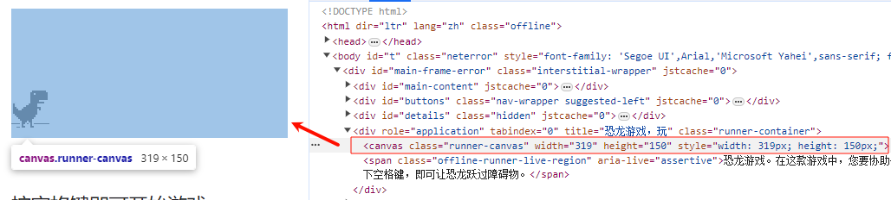

小恐龙用`canvas`实现


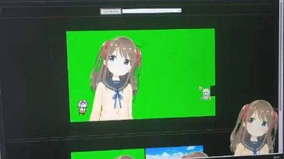

基于`canvas`的绿幕抠像


### `iframe`：嵌入一个网页

```html
    <iframe 
        id="inlineFrameExample"
        title="Inline Frame Example"
        width="300"
        height="200"
        src="https://www.openstreetmap.org/export/embed.html?bbox=-0.004017949104309083%2C51.47612752641776%2C0.00030577182769775396%2C51.478569861898606&layer=mapnik">
    </iframe>
```

会被渲染成这样：
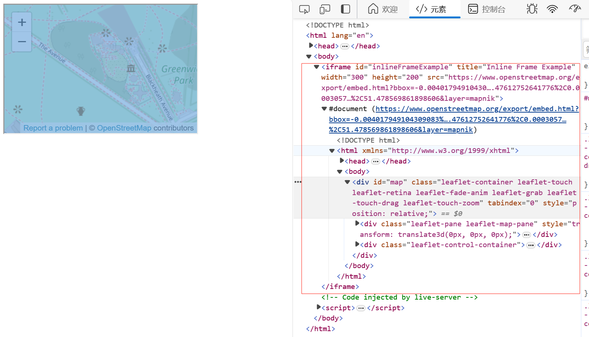

<br>


`iframe`中有他自己的`<html>`，也有对应的方法去操作`iframe`里面的标签。


嵌入b站视频，准确来说是连同播放器一起嵌入

```html
    <iframe src="//player.bilibili.com/player.html?aid=751803889&bvid=BV1xk4y1S7ts&cid=1419440467&p=1" scrolling="no" border="0" frameborder="no" framespacing="0" allowfullscreen="true"> </iframe>
```
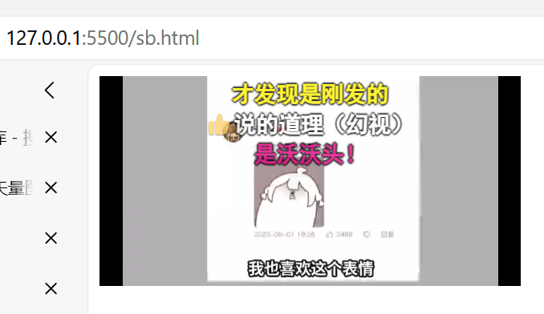


妙用`iframe`：看漫画由于某些原因加载很慢，点下一页加载半天怎么办，可以写一个插件自动在当前页面生成下一页的`iframe`，利用浏览器缓存的原理缓存了就不用再加载了，使得在当前页就加载好了下一页的图片，再把`iframe`隐藏。

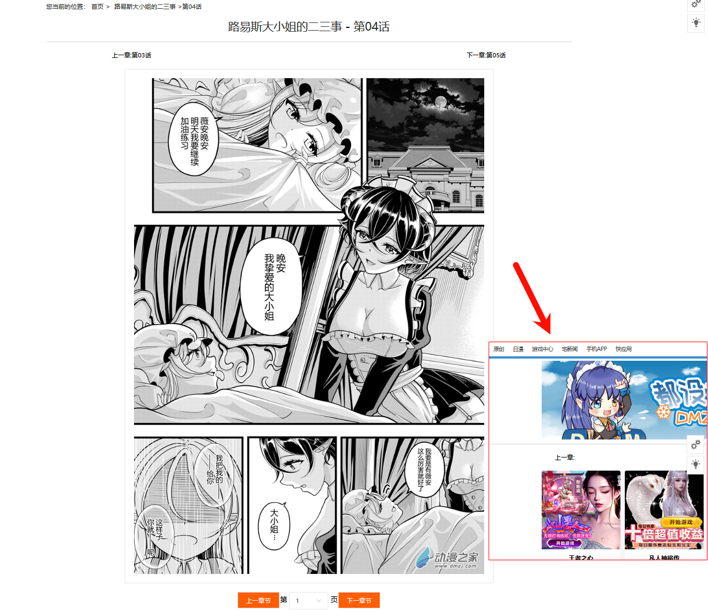


## 表单标签

用`form`包裹，处理提交事件

```html
<form onsubmit="return handleSumbit(event)" action="#">
            <div class="name item">
                <div class="title">Full legal name</div>
                <input type="text" name="name" required>
            </div>

            <button>Sign up for free</button>
        </form>
```

或者也可以不用`form`，利用`querySelector`手动拿到所有输入框的值。注意`checkbox`不是`value`是`checked`。

```js
    你的名字
    <input type="text" name="name" id="">

    你的方法
    <input type="checkbox" name="loan" id="">贷款
    <input type="checkbox" name="borrow" id="">借钱
    你的车
    <select name="cars">
        <option value="volvo">Volvo</option>
        <option value="saab">Saab</option>
        <option value="fiat">Fiat</option>
        <option value="audi">Audi</option>
    </select>
    <button type="button" onclick="getFormData()">获取表单值</button>

    <script>
        function getFormData() {
            const data = {
                name: document.querySelector('[name="name"]').value,
                loan: document.querySelector('[name="loan"]').checked,
                borrow: document.querySelector('[name="borrow"]').checked,
                cars: document.querySelector('[name = "cars"]').value
            };
            console.log(data);
        }
    </script>
```


其实在2018年以后，随着Angular、React和Vue框架的兴起严格意义上的表单元素现在已经基本见不到了，取而代之的是拿`<div>`和`<input>`等通用组件配合CSS3和JS拼的各种更强大的组件。


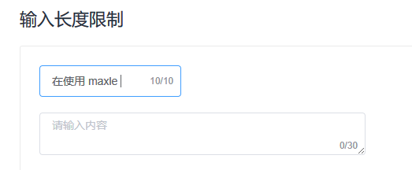


     element-ui封装好的组件  


（案例：优雅的表单校验：函数式+js重点操作+抽离rules+form表单）


## HTML5语义化标签


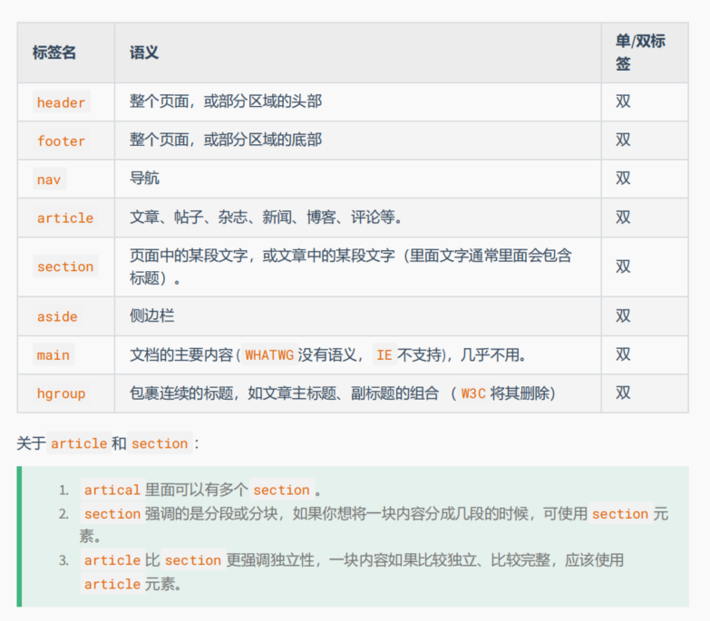

**为什么写一大堆div不好？**

因为标签名是屏幕阅读器理解网页内容的关键之一，全是div意味着根本找不到网页中哪些部分是重要的。

`<h1>`这种也能帮助谷歌搜索引擎识别网页中的标题部分。（SEO）

这些语义化标签（了解）本质都跟div一样，但用语义区分开来就是为了语义化和使得辅助技术（如屏幕阅读器）能够更好地理解和解析页面内容，使得残障用户能够正常浏览和使用网页。


##### meta标签（了解）

meta是html文档在head标签里定义的一个对文档进行描述的功能性标签

meta标签有下面的作用：

　　1.搜索引擎优化（SEO）

　　2.定义页面使用语言

　　3.自动刷新并指向新的页面

meta标签的组成：meta标签共有两个属性，它们分别是http-equiv属性和name属性，不同的属性又有不同的参数值，这些不同的参数值就实现了不同的网页功能。

```
 <!DOCTYPE html>  H5标准声明，使用 HTML5 doctype，不区分大小写
 <head lang="en"> 标准的 lang 属性写法
 <meta charset="utf-8">    声明文档使用的字符编码
 <meta http-equiv="X-UA-Compatible" content="IE=edge,chrome=1"/>   优先使用 IE 最新版本和 Chrome
 <meta name="description" content="不超过150个字符"/>       页面描述
 <meta name="keywords" content=""/>      页面关键词
 <meta name="author" content="name, email@gmail.com"/>    网页作者
 <meta name="robots" content="index,follow"/>      搜索引擎抓取
```

## LocalStorage

借助本地存储可以在浏览器中存储键值对，并且一直保留，即使刷新页面或者关闭浏览器。

- `setItem(key, value)` —— 存储键/值对。
- `getItem(key)` —— 按照键获取值。

```js
localStorage.setItem('name','sb');
const name = localStorage.getItem('name');
```

需要注意的是，键和值的格式必须为字符串，也就是说直接存对象是存不了的。

```js
localStorage.user = {name: "John"};
alert(localStorage.user); // [object Object]
```

这时把对象转成JSON文本就可以正常存储了。

```js
localStorage.user = JSON.stringify({name: "John"});

// sometime later
let user = JSON.parse( localStorage.user );
alert( user.name ); // John
```

sessionStorage

api与这个一样，不过几乎用不到，这里只做个介绍。

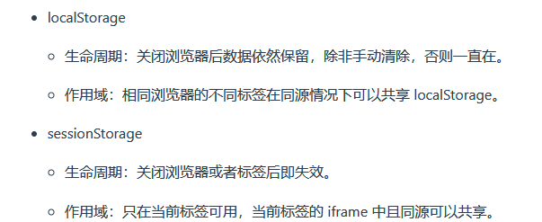


## CSS选择器


```
（1）id选择器（#myid）
（2）类选择器（.myclassname）
（3）标签选择器（div,h1,p）
（4）后代选择器（h1 p）
（5）相邻后代选择器（子）选择器（ul>li）
（6）兄弟选择器（li~a）
（7）相邻兄弟选择器（li+a）
（8）属性选择器（a[rel="external"]）
（9）伪类选择器（a:hover,li:nth-child）
（10）伪元素选择器（::before、::after）
（11）通配符选择器（*）
```

建议使用class而非id，因为id的权重太大了。通常使用class，只会在vue或react框架的根元素上见到id。

（实例：纯css实现二级菜单）


## 基本属性

不细说了

```css
    border-radius:8px;
font-family: Inter;
font-weight: 400;
line-height: 19px;
letter-spacing: 0em;
text-align: center;
text-decoration: underline;
background: url("./xx.png") no-repeat;
```


## 重点属性

```css
cursor: pointer; //鼠标变pointer
user-select:none; //选中不了元素
m0 p0 //清除默认样式 
outline:none; //禁用默认轮廓，内置的元素并没有outline属性，某些情况下，浏览器可能会为某些元素应用默认的 outline 样式，以提供一些可访问性或焦点提示（比如使用键盘导航时）。禁用默认轮廓可能会影响可访问性。
overflow:hidden; //溢出隐藏
object-fit：cover; //可以让图片保持其宽高比的同时填充元素的整个内容框
box-shadow: rgba(17, 12, 46, 0.15) 0px 48px 100px 0px; //盒子阴影(也有text-shadow)
```

**(实例：清除 h1 b u ul a button的默认样式)**

会了这个就表明你充分地理解了基本元素的样式的实现原理。

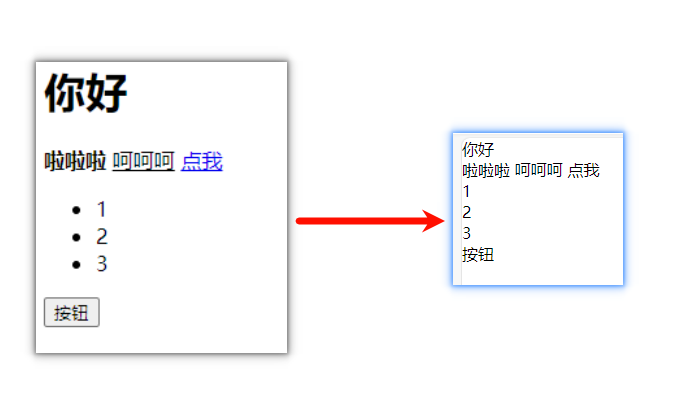

```css
          * {
        margin: 0;
        padding: 0;
    }

    h1 {
        font-size: 16px;
        font-weight: normal;
    }

    b {
        font-weight: normal;
    }

    u {
        text-decoration: none;
    }

    a {
        text-decoration: none;
        color: black;
    }

    a:hover {
        cursor: auto;
    }

    ul {
        list-style: none;
        padding: 0;

    }

    button {
        background-color: #fff;
        border: 0;
        font-size: 16px;
    }
```


**（实例：实现图片背景）**

```css
       //简单的background版本
	body {
            background: url(./1.jpg) no-repeat center center fixed;
        // 不重复 水平居中 垂直居中 相对视口固定
        }

		//img版本
        img {
            width: 100%;
            height: 100%;
            object-fit: cover; 
            object-position: center; //对象在容器中的位置为居中
            display: block;
            position: absolute;
            top: 0;
            left: 0;
            z-index: -1;
        }
```


## 盒模型

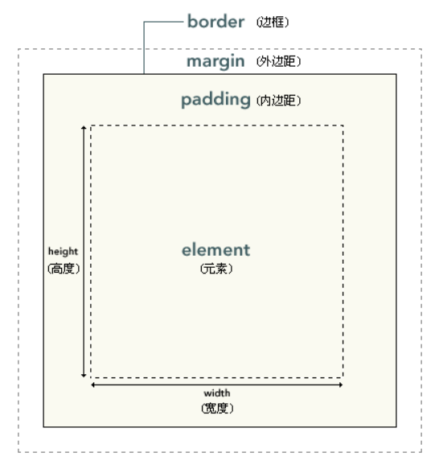


```css
//一起指定
border: 10px solid red;
margin: 10px;
padding: 10px;
//同时指定
marigin:10px 20px; //上下10 左右20
marigin:10px 20px 30px; //上10 左右20 下30
marigin:10px 20px 30px 40px; //上10 右20 下30 左40
//分别指定
marigin-left: 10px;
marigin-top: 10px;
marigin-bottom: 10px;
marigin-right: 10px;
```

<br>

**块级盒子（Block box）和 内联盒子（Inline box）**

| 块级盒子（Block box）                                        | 内联盒子（Inline box）                                       |
| ------------------------------------------------------------ | ------------------------------------------------------------ |
| div p h1~h6 ul/ol/li table                                   | span a img i b                                               |
| 盒子会在内联的方向上扩展并占据父容器在该方向上的所有可用空间，在绝大数情况下意味着盒子会和父容器一样宽，比如body中单独放置div会占满一行。 | 未指定其他属性时，盒子的宽高只取决于内容的多少，比如p的文本里放置span可以很好地融入不产生换行，不用指定宽高，该多大就多大。 |
| 每个盒子都会换行                                             | 盒子不会产生换行                                             |
| [`width`](https://developer.mozilla.org/zh-CN/docs/Web/CSS/width) 和 [`height`](https://developer.mozilla.org/zh-CN/docs/Web/CSS/height) 属性可以发挥作用 | [`width`](https://developer.mozilla.org/zh-CN/docs/Web/CSS/width) 和 [`height`](https://developer.mozilla.org/zh-CN/docs/Web/CSS/height) 属性将不起作用。 |

<br>

这些并不是定死的，可以通过display转换，使得div可以内联，img可以块：

```css
display: block;
display: inline;
display: inline-block;
//inline-block: 既能指定宽高，又不换行。
```


<br>

**box-sizing**

可以指定为`border-box`或者`content-box`，默认值为后者。

> （1）W3C标准盒模型（content-box）：属性width，height只包含内容content，不包含border和padding
>
> （2）IE盒模型（border-box）：属性width，height包含content、border和padding，指的是content
> +padding+border。
>
> border-box相对好用一些，因为**指定是多少宽高就是多少宽高，不会因为修改内部样式影响外部**。
>
> 在页面中声明了DOCTYPE类型，所有的浏览器都会把盒模型解释为W3C盒模型。

## 伪类/伪元素

- `:hover`：鼠标悬停时应用样式。

- `:active`：元素被激活或按下鼠标按钮时应用样式。

- `:focus`：元素获得焦点时应用样式，通常用于表单元素。

- `:first-child`：选择父元素的第一个子元素。

- `:nth-child(n)`：选择父元素的第 n 个子元素，其中 n 是一个整数，不考虑元素类型。

- `:nth-of-type(n)`：选择父元素中相同类型的第 n 个子元素，其中 n 是一个整数。

  选择父元素的子元素其实就是跟自己同级的，不要以为是child就是自己的子级。比如div > p结构里面指定第2个item不应该写div:nth-child(2)，而是p:nth-child(2)，选择p的父级div的第二个子级p。

  **n的花活**

  n=1,2,3,4,5,....

  选择所有元素: `n`

  选择所有奇数元素：`2n+1`

  选择所有偶数元素：`2n`

  选择第6个元素以及之后所有的：`n+5`

  选择第1-5个元素: `-n+5` (注意`5-n`不对，`5-n`表示选择的是从第五个子元素开始往前数的元素。这样的表达式在 CSS 中是无效的，因为 CSS 的 `:nth-child` 只能表示从第一个元素开始往后数的情况)

- `::before`：在元素内容之前插入生成的内容。
- `::after`：在元素内容之后插入生成的内容。
- `::first-line`：选择元素的第一行文本。
- `::first-letter`：选择元素的第一个字母。
- `::selection`: 文本被鼠标选中后的样式。

最常用的是`::before`和`::after`，可以在使用css来插入元素避免过于复杂的HTML结构。

注意，伪元素必须设置`display`和`content`才能显示。

(实例: 图片上加文字)

注意：``这种单标签不能直接使用`::after`这些伪元素。

```css
    <style>

        .avatar {
            width: 100px;
            height: 120px;
        }

        img {
            width: 100px;
            height: 100px;
            border-radius: 50%;
            object-fit: cover;
            display: block;
        }

        .avatar::after {
            content: attr(name);
            display: inline-block;
            width: 100%;
            text-align: center;
        }
    </style>
    
    <div class="avatar" name="幻小芒">
        
    </div>

```

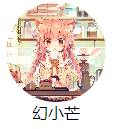


## 定位

| 属性名         | 含义                                                         |
| -------------- | ------------------------------------------------------------ |
| **`static`**   | 默认值，遵循正常的文档流。                                   |
| **`relative`** | 相对定位，元素相对于其正常位置进行定位，然后通过 `top`、`right`、`bottom`、`left` 属性进行微调。相对定位不会使元素脱离文档流。 |
| **`absolute`** | 脱离文档流，相对于其最近的非`static`（非默认定位）的父元素进行定位。如果没有这样的父元素，则相对于 `<html>` 元素。 |
| **`fixed`**    | 固定定位，元素脱离文档流，相对于浏览器窗口进行定位。即使用户滚动页面，元素也会保持在相同的位置。 |
| **`sticky`**   | （了解）粘性定位，元素根据用户的滚动位置在某个范围内定位。在滚动到达指定位置之前，元素是相对定位的；在滚动到达指定位置之后，元素切换为固定定位。 |

**脱离文档流**（Out of Flow）是指元素不再按照正常的文档流排列，而是被从文档流中取出并放置到一个不同的位置。脱离文档流的元素不再占据原来在文档流中的空间，因此其他元素会以不考虑脱离文档流元素的位置进行排列。可以理解为放到另一个图层上了，可以通过`z-index`调整图层顺序（z坐标）。

`float`浮动也会使元素脱离文档流，但浮动在现在已经很少见了，完全可以用其他布局模式代替，这里不赘述。

<br>

**什么是子绝父相?**

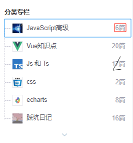

为了实现“6篇”文字（红色元素）后置并与右侧始终保持5px，可以给红指定绝对定位使`right:5px`来实现，但必须要将其父元素蓝色元素指定为相对定位。

根据`absolute`特性，只有使蓝为相对定位时，红才能相对蓝进行定位，否则可能就会相对html元素定位了。

同时因为是相对定位，不会脱离文档流，不用担心对蓝的布局有任何影响。


## transform与animation

```css
.box {
  transform: translate(50px, 50px) rotate(45deg) scale(1.5); //平移 旋转 缩放
}
```

```css
        @keyframes slide {
            0% {
                transform: translateX(0);  
            }

            50% {
                transform: translateX(200px);
            }

            100% {
                transform: translateX(0);
            }
        }

        .slide-animation {
            animation: slide 2s ease-in-out infinite; //动画名称 持续时间(默认为0) 时间函数 播放次数
        }
```

```css
        .slide-animation {
            transition: all 1s ease-in-out; 
        }
```

 `transition`为一个元素在不同状态之间切换的时候定义不同的过渡效果，注意初始和结束状态必须是值发生改变，比如`translateX(0)`到`translateX(200px)`，对于`display`从`none`到`block`不会生效，如果想设置元素逐渐显现的效果，应当把初始状态设置`display`为`block`并且`opacity`为0，结束状态设置`opacity`为1。


## flex与grid


### flex 

#### 主轴与交叉轴

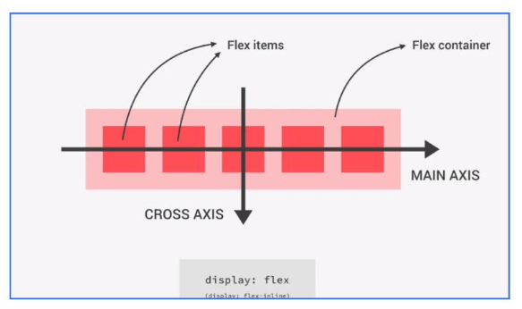


#### 容器属性

**`flex-direction`**：容器主轴方向（`column`/`row(默认)`）

**`justify-content`**：主轴方向的排列方式（`center`/`space-evenly`/`space-between`/`space-around`/...）

**`align-items`**：交叉轴方向的排列方式（`center`/`stretch`）

**`flex-wrap`**：是否换行（`wrap`/`nowrap(默认)`）


#### 项目属性

**`align-self`**：项目自身设置单独的交叉轴对齐方式（`flex-end`/`auto(默认)`）


视频动画：

[flex弹性布局 动画详解系列 css科普教程_哔哩哔哩_bilibili](https://www.bilibili.com/video/BV1Rv4y177rj/)


#### 练习

#### https://www.lanqiao.cn/courses/21282/learning/?id=1021399

https://www.lanqiao.cn/courses/21282/learning/?id=1031388

https://www.lanqiao.cn/courses/21282/learning/?id=1031390

https://www.lanqiao.cn/courses/21282/learning/?id=1034951


### grid  

[用Grid布局制造魔法：打造你的网页设计_哔哩哔哩_bilibili](https://www.bilibili.com/video/BV1Ce411q7be/)


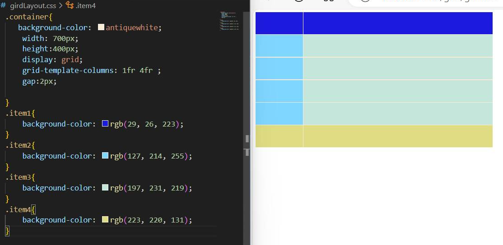

grid可以轻松实现表格布局。


对比:

`flex`做一些布局时非常方便，但遇到比较复杂一点的用`grid`代码量会更少。

通常是flex使用比较多，毕竟很多场景用一个flex就够了。


## 居中方案

文本水平：`text-align`或者`flex`

文本垂直：`line-height`或者`flex`


元素居中：

1. 水平：`margin: 0 auto`;

2. `flex`/`grid`

   ```css
   .container {
     display: flex;
     justify-content: center; /* 水平居中 */
     align-items: center; /* 垂直居中 */
   }
   
   .container {
     display: grid;
     place-items: center; /* 同时水平垂直居中 */
   }
   ```

   

3. `absolute/relative` + `transform`  `transform: translate(-50%, -50%);`

   ```css
   .parent {
     position: relative;
   }
   
   .child {
     position: absolute;
     top: 50%;
     left: 50%;
     transform: translate(-50%, -50%);
   }
   ```

   

4. `absolute` + `m:auto` + `inset0（trbl0）`

   ```css
   .box{
   	position: absolute;
       marigin: auto;
       inset: 0;
       /* 相当于
        	top: 0;
       	left: 0;
       	right: 0;
       	bottom: 0;
       */
   }
   ```

   


## 常见布局


**`flex`属性讲解**

使用`flex: xx`简写时，第一个值是flex-grow（也就是`flex-grow: 1;`可以写成`flex: 1;`），可以理解为元素的伸长，后面的值在进阶篇介绍，在这里我们只关注这一个值。

**设置了子元素width:**

`flex-grow`可以使元素利用剩余空间，实现填充等效果。


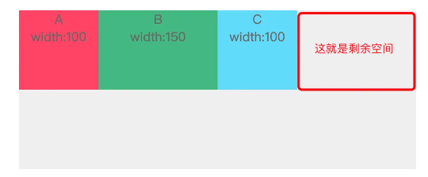

子容器的宽度总和只有 350px，父容器宽度为 500px，那么剩余空间就出现了，为 150px。当设置了 `flex-grow` 之后， A，B，C三个子容器会根据自身的 `flex-grow` 去“瓜分”剩余空间。

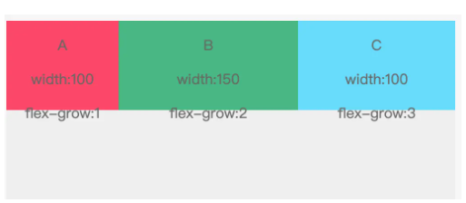

**不设置子元素width:**

如果不设置`width`（`width`默认值为auto），设置相同的`flex-grow` 可以让他们平分空间：

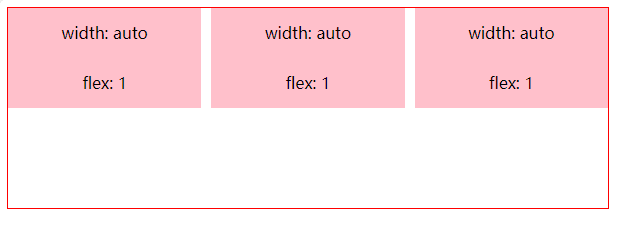

如果不设置`width`，他们占用空间的比例等于`flex-grow`的比例。

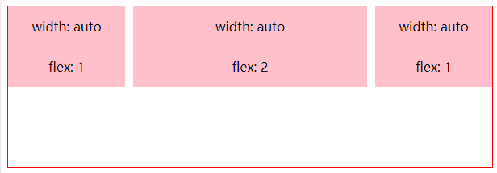


**单栏布局**

`header`和`footer`固定高，`content`填充剩余空间：（父容器为`.wrap`）

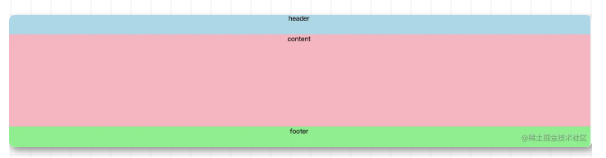

```css
html, body {
  height: 100%;
  margin: 0;
}

.wrap {
  display: flex;
  flex-direction: column;
  min-height: 100%;
}

.header {
  height: 50px;
  background: lightblue;
}

.content {
  background: lightpink;
  flex: 1;
}

.footer {
  height: 50px;
  background: lightgreen;
}

```


**两栏布局/三栏布局**

两栏布局就是一边固定，另外一边自适应：

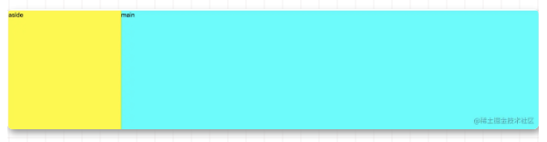


```css
div {
  height: 500px;
}

.wrap {
  display: flex;
}

.aside {
  width: 300px;
  background: yellow;
  
}

.main {
  background: aqua;
  flex: 1;
}
```

三栏布局就是两边固定，中间自适应布局：

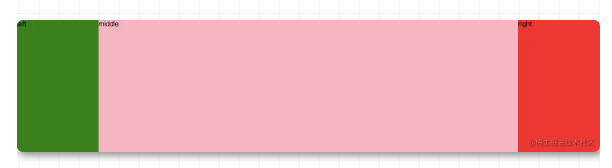

```css
.wrap {
  display: flex;
}

.left {
  width: 200px;
  background: green;
}

.right {
  width: 200px;
  background: yellow;
}

.middle {
  background: lightpink;
  flex: 1;
}
```

其实上述3个例子都一样，**自适应**的本质就是flex控制其占用剩余空间。


##### 自适应/响应式布局

通常有两种方案：一是手机端pc端写两版布局，通过判断切换；另一个是写一个通用的可以根据屏幕大小变化的响应式布局。

**媒体查询**

三端自适应原理：

```css
//直接写，默认为PC
xxxx

//平板
@media (max-width: 1199px) and (min-width: 769px) {
    xxxx
}
//移动设备
@media (max-width: 769px) {
    xxxx
}
```

其实还有很多更好的css方案来实现响应式的效果，媒体查询这种写法实在不优雅，所以现在也很少见到了。这里只是因为蓝桥杯要考所以要会。


关于复习与总结基本就是这些，如果有疏漏日后再补充。


### 练习

https://www.lanqiao.cn/problems/5133/learning/?page=4&first_category_id=2&second_category_id=11

https://www.lanqiao.cn/problems/2321/learning/?page=2&first_category_id=2&second_category_id=11


 
