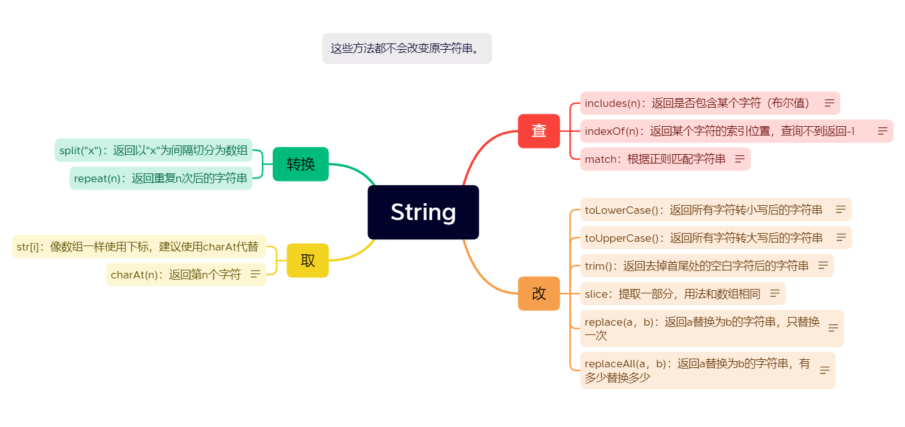
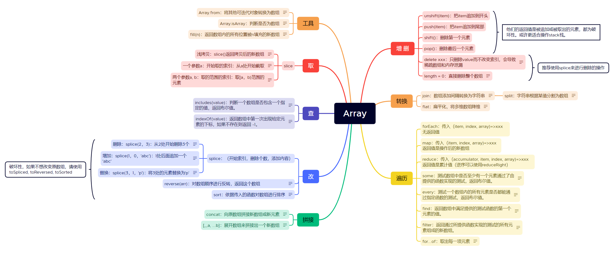
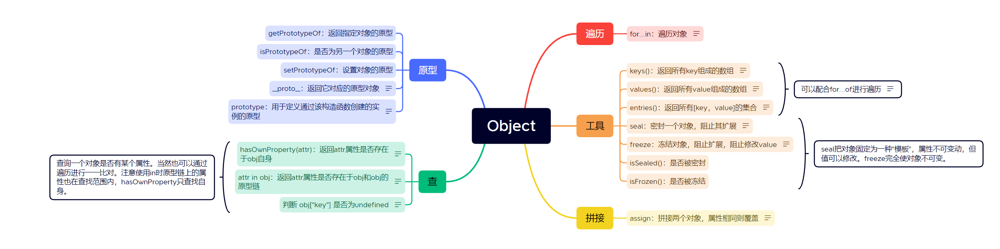
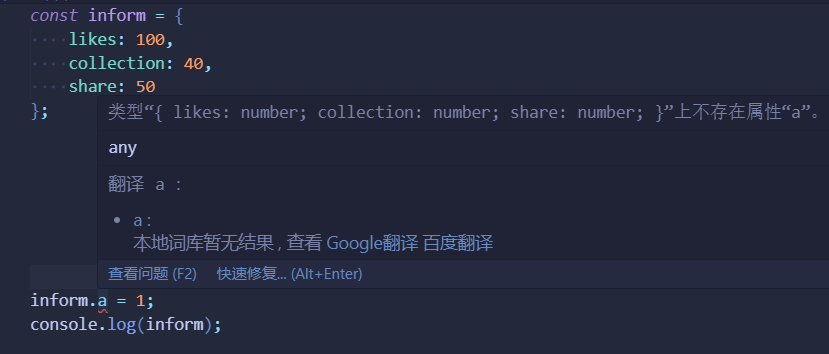
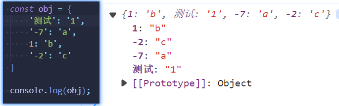
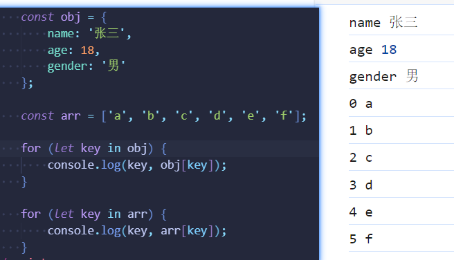
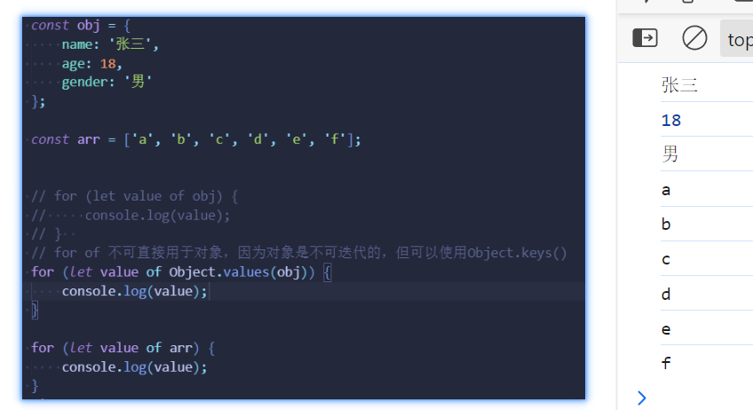
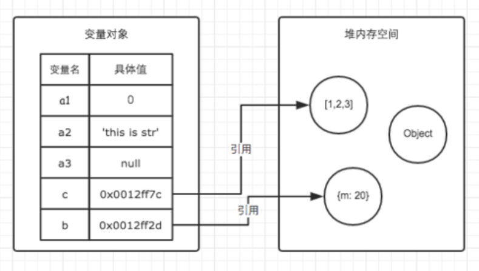

# JavaScript重点内容

js学习资料

**基础**：李立超js https://www.bilibili.com/video/BV1mG411h7aD

相当通俗易懂，不过jq的部分不需要再看了。

**进阶**：后盾人js https://www.bilibili.com/video/BV1NJ411W7wh/

看起来好像还是那些知识，但融入了大量实战的东西，让你对知识的理解不再浮于表层。

有基础才能看，一边看的时候会一边感叹“woc 还能这么写”，但基础不全完全听不懂。

**思想**：小野森森（2个号，直接搜就行）

光会语法是不行的，更要懂怎么设计、怎么分层、抽离等等，才能写好清晰的逻辑，驾驭住越来越复杂的情况。


## 基础补充

### var  let  const用哪个

所有不会改变的常量用`const`。

会改变的变量用`let`。在实际项目中可能比`const`少得多。

`var`的历史遗留问题过多，禁用var。


### 相等与全等

`===`：判断值相等的同时判断类型是否相等。

`==` ：判断值是否相等，如果类型不同则转换为相同类型再判断。

比赛时建议使用`==`，因为不用考虑可维护性，全等反而容易给自己挖坑。

> 以下判断都为`true`:
>
>  [] == false  0 == !!0 null == undefined
>
> 如果替换为`===`，则都为`false`。


在一些框架中，为了更加严谨，会使用`Object.is`来替代`===`。

```js
Object.is("foo", "bar"); // false
```


### 链式赋值

```js
let a;
let b;
a = b = 1;
a = (b = 1); // 也可以加上括号
```

这里的链式赋值意味着首先将1赋给变量`b`，然后将`b`的值再赋给变量`a`。因此，`a`和`b`最终都被赋值为1。


在`while`里面使用：

```js
    let stack = [1, 2, 3, 4, 5];
    let curr;
    while (curr = stack.shift()) {
        console.log(curr);
    }
//此时修改shift为pop，就能实现逆序。
```


### 短路运算

在逻辑运算中，我们常用与和或两个运算符：

- a || b，只要`a`和`b`其中一个为`true`，则整个表达式的运算结果为`true`。 

- a && b，只有所有`a`和`b`都为`true`，则整个表达式的运算结果才为`true`。

在短路运算中：

-  a || b，如果`a`为`false`，才走`b`，否则不走`b`。 

-  a && b，只有`a`为`true`，才走`b`，否则不走`b`。

以下是两种及其常见的场景：

用于赋值：

```js
let response = request(); //可能返回空
let result = res || [];  //如果res是null、undefined就会被转为false，取后面的值，也就是把[]赋给result
```

用于表达式执行：

```js
let shouldShow = true; 
shouldShow && console.log(xxx); //如果shouldShow为true，才执行后面的语句。
```


### 类型转换

数字 => 字符串：1+"" => "1"

字符串 => 数字：+"1" => 1

数字/字符串 => 布尔值：!!0 => false;   !!"1" => true


注意，两个不同类型的数据相加时，会优先以字符串类型为准，其次是数字类型。

```js
console.log(1+"abc")
// 1abc
console.log(1+true)
// 2
console.log(1+{})
// 1[object Object]
```


## String字符串




<a href="./../xmind/String.xmind">下载链接</a>


## Array数组

```js
// 以此方式声明一个空数组。
const arr = [];
// 声明一个长度为5的数组。
const arr = Array(5);
// 声明一个长度为5值都为1的数组。
const arr = Array(5).fill(1);
```

方法概览：



<a href="./../xmind/Array.xmind">下载链接</a>


### 破坏性

函数会改变本身的方法，我们称为其具有破坏性。

遍历方法中如果改变原数组，也会展示出破坏性。

在函数式编程中，我们应该遵循“纯函数”的原则，尽量避免破坏原数组。


### 遍历方法（重点）

`forEach`接受一个参数`callbackFn`函数，此函数可以拿到三个参数：`item`当前项、`index`当前索引、`array`原数组。

使用`forEach`进行遍历：

```js
const array1 = ['a', 'b', 'c'];

array1.forEach((item，i) => {
    console.log(`第${i}项: ${item}`);
});
```


`map`的使用方法相同，只不过多了一个返回值，返回操作后的新数组。

```js
const array2 = [1,2,3];

const array3 = array2.map((num)=>num*2);

console.log(array3);
// 2,4,6
```


不过在某些情况，我们要算一些累积值时，我们需要这样写：

```js
       //计算总数
		const arr1 = [1, 2, 3, 4, 5];

		let total;
        arr1.map((item) =>{
            total += item;
        })
        
		//按奇偶分类
        const arr2 = [1, 2, 3, 4, 5];

        const result = {};
        arr2.map((item)=>{
            if(item%2 === 0){
                if(!result['even']){
                    result['even'] = [];
                }
                result['even'].push(item);
            }else{
                if(!result['odd']){
                    result['odd'] = [];
                }
                result['odd'].push(item);
            }
        })
        
```

我们发现，每次都要提前声明一个累计值变量。

`reduce`提供了更好的做法：

```js
       //计算总数
const arr1 = [1, 2, 3, 4, 5];

        let total = arr1.reduce((acc, item) => {
            return acc + item;
        }, 0);


//按奇偶分类

        const arr2 = [1, 2, 3, 4, 5];

        const result = arr2.reduce((acc, item) => {
            if (item % 2 === 0) {
                if (!acc['even']) {
                    acc['even'] = [];
                }
                acc['even'].push(item);
            }else {
                if (!acc['odd']) {
                    acc['odd'] = [];
                }
                acc['odd'].push(item);
            }
            return acc;

        }, {});

```

在`reduce`的写法中，不再需要提前声明一个变量，而累计值作为参数`acc`传入函数中，这就避免了污染外部作用域。

- `reduce`中`callbackFn`就是比`map`和`forEach`多了一个`accumulator`累加器。

- `callbackFn`后面还可以传入一个参数`initialValue`，作为`acc`的初始值。

- 注意`callbackFn`的末尾需要把处理好的`acc` return出去，否则下一次的迭代拿不到值。

**`reduce`其实就是简化了处理累加值的过程。**


> 想要彻底掌握`reduce`，大量的使用必不可少。其实每个函数都是，只有你在日常coding时突然灵光一闪想到了这个方法然后尝试去用，才能把他变成你自己的东西。


## Object


对象可以存储各种`key`-`value`键值对。
```js
  const person = {
      first: 'Albert', 
      last: 'Einstein',
      year: 1879, 
      passed: 1955,
      'has lots of money': true,   //使用多词语做属性名要加引号
      'rich': true,                //其实用rich就相当于'rich'，由于对象的key只能是string，所以可以不写引号
  };
```


```js
person.rich  
person['rich']

person.has lots of money  //识别不了
person['has lots of money'] // 必须使用方括号
//方括号表示的也叫动态属性，可以动态地取出：
person[person.rich ? 'year':'passed']
```




<a href="./../xmind/Object.xmind">下载链接</a>


> 蓝桥杯题偏实际场景，原型的考点占比很小。
>
> 原型方法一般用来操作函数的原型进行面向对象编程，不过class出现之后也不再需要了。
>
> 所以平常很少使用到。


### 应用

##### 密封对象

```js
        const inform = Object.seal({
            likes: 100,
            collection: 40,
            share: 50
        });

        inform.a = 1;
        console.log(inform);
```

一个作品的信息有点赞、收藏、分享并且只有这些。那么在代码中添加其他属性是非常不好的，可以用`seal`来将`inform`密封，只允许修改值，不可增删属性。

其实之后换成`typescript`就完全不用担心，会在写代码的时候就直接报错：




##### `assign`批量修改`css`值

```js
    el.style.visibility = 'visible';
	...
    ...
    
// 一个一个写太麻烦

	Object.assign(el.style, {
        visibility: 'visible',
        position: 'initial',
        height: 'auto'
    })
// 优雅
```


## Array  VS Object

### 取值

对象可以`obj['xxx']`，数组可以`arr[0]`，

对象可以`obj.xxx`，数组不可能`arr.0`，变量名不可能以数字开头。

其实数组的本质是对象，键是索引，值是每个数组元素。

```js
const list = ['a','b','c'];
// 可理解为

const list = {
    0: 'a',
    1: 'b',
    2: 'c'
}
```

所以你也可以像一样操作对象，像对象一样操作数组：

```js
    const obj = {
        0: 'a',
        1: 'b',
    }

    console.log(obj[1]);  // b

    const array = [1, 2, 3];
    array.a = 2;
    console.log(array.a);  // 2
```


> 所以网上有很多看上去相当抽象的面试题，充满各种奇怪的写法，其实就是在考你是否理解他的本质。

### 顺序性

数组是有序的，数组元素的顺序就是索引的顺序。

对象是有一种特殊的顺序：一般情况下，对象的顺序由设置该属性的先后决定。先添加的属性在先，后添加的反之。

但如果索引是这样：



顺序就变得相当奇怪，所以**对象的顺序并不靠谱**，应尽量避免编写依赖对象属性顺序的代码。

### 遍历

你可以这样理解：

`for ... in` 是取key

`for ... of `是取value

所以可以这样用：






可以看出`for ... in`也可以用于数组，不过mdn不推荐这样做。

一般还是`for ... in`用于对象，`for ... of`用于数组。

对于数组，for循环的操作更加灵活一些，但对于只需要顺序迭代的情况还是`for ... of`更简洁。（不过for循环性能确实好一些，但一般也不差那点性能）


### 解构赋值

这是一种特殊的语法，它使我们可以将数组或对象“拆包”至一系列变量中。有时这样做更方便。

```js
// 我们有一个存放了名字和姓氏的数组
let arr = ["John", "Smith"]

// 解构赋值
// 设置 firstName = arr[0]
// 以及 surname = arr[1]
let [firstName, surname] = arr;

alert(firstName); // John
alert(surname);  // Smith
```

```js
let options = {
  title: "Menu",
  width: 100,
  height: 200
};

let {title, width, height} = options;

alert(title);  // Menu
alert(width);  // 100
alert(height); // 200
```

应用

```js
        let options = {
            title: "Menu",
            width: 100,
            height: 200
        };

        function handleXxx(options) {
            // 需要options.title options.width options.height这样写
        }

        handleXxx(options);


        //使用解构
        function handleXxx(options) {
            const { title, width, height } = options;
            // 这样写title width height可以直接使用
        }

        handleXxx(options);

        //还可以直接在参数上解构
        function handleXxx({ title, width, height }) {
            // 这样写title width height可以直接使用
        }
```

```js
		// entries直接使用解构
        const object1 = {
            a: 'somestring',
            b: 42,
        };

        for (const [key, value] of Object.entries(object1)) {
            console.log(`${key}: ${value}`);
        }
```


### 展开

与解构的“按需取用”不同，展开运算符将内部所有元素都取出来：

```js
    const obj = {
        name: '张三',
        age: 18,
        gender: '男'
    };

    const arr = ['a', 'b', 'c', 'd', 'e', 'f'];

    console.log(...arr);
    // 'a', 'b', 'c', 'd', 'e', 'f'
    console.log(...obj); 
    // 报错
    // 注意对象是不能直接展开的
```

但可以在{}中展开，用于构成一个新对象：

```js

        // 默认配置
        let defaultOptions = {
            title: "Menu",
            width: 300,
            height: 800
        };

        //用户配置
        let userOptions = {
            width: 100,
            height: 200
        };

        const finalOptions = { ...defaultOptions, ...userOptions };
        console.log(finalOptions);
        // 输出 
        // { title: 'Menu', width: 100, height: 200 }
```

在这里默认配置是要和用户配置合并的，相同的值要被覆盖，所以展开的顺序是先`default`后`user`，像`Object.assign`一样，不过这样更加清晰简洁。


### 复制

众所周知，数组和对象是引用类型，直接使用等号来复制是不行的，改变新的变量还是会影响到原数组，因为他们指向相同的引用。




**浅复制**

数组

```js
    // 使用解构 这是最方便的
    const numbers = [1, 2, 3];
    const numbersCopy = [...numbers];

    // map 让每个数组的元素都返回它自己
    numbers = [1, 2, 3];
    numbersCopy = numbers.map((x) => x);
    
    // slice 不传值就是默认返回包含所有元素的新数组
    numbers = [1, 2, 3, 4, 5];
    numbersCopy = numbers.slice();
    // [1, 2, 3, 4, 5]

    // concat 不合并值就是返回一个一样的新数组
    [1, 2, 3].concat(); // [1, 2, 3]
```

对象

```js
const obj = { foo: "foo", bar: "bar" };
const copy = { ...obj }; // Object { foo: "foo", bar: "bar" }
```


**深复制**

浅复制只复制一层，如果其中的值又是一个引用类型就不行了。

可以使用`JSON`来转：

```js
    const nestedNumbers = [[1], [2]];
    const numbersCopy = JSON.parse(JSON.stringify(nestedNumbers));

    numbersCopy[0].push(300);
    console.log(nestedNumbers, numbersCopy); //不同
```

或者使用递归也可以，但是比较笨重。


## 练习

https://www.lanqiao.cn/problems/5135/learning/?page=4&first_category_id=2&second_category_id=11

https://www.lanqiao.cn/problems/2438/learning/?page=3&first_category_id=2&second_category_id=11


### 数组常用方法

```js
const inventors = [
  { first: 'Albert', last: 'Einstein', year: 1879, passed: 1955 },
  { first: 'Isaac', last: 'Newton', year: 1643, passed: 1727 },
  { first: 'Galileo', last: 'Galilei', year: 1564, passed: 1642 },
  { first: 'Marie', last: 'Curie', year: 1867, passed: 1934 },
  { first: 'Johannes', last: 'Kepler', year: 1571, passed: 1630 },
  { first: 'Nicolaus', last: 'Copernicus', year: 1463, passed: 1543 },
  { first: 'Max', last: 'Planck', year: 1858, passed: 1947 },
  { first: 'Katherine', last: 'Blodgett', year: 1898, passed: 1979 },
  { first: 'Ada', last: 'Lovelace', year: 1768, passed: 1852 },
  { first: 'Sarah E.', last: 'Goode', year: 1855, passed: 1905 },
  { first: 'Lise', last: 'Meitner', year: 1878, passed: 1968 },
  { first: 'Hanna', last: 'Hammarström', year: 1829, passed: 1909 }
];
```

设计函数，输入inventors，返回值是：

1. 过滤出1800年后出生的人

2. 所有人全名的集合

3. 返回Ada和Lise被删除了的数组 (不允许改变原数组)

4. 出生年份正序作为新顺序 (不允许改变原数组)

5. 统计出1900年前死的人数

6. 他们所有人寿命的平均值

7. 把生于1800年后的人和前的人分类,返回一个新对象，形如

   {

     "<1800": [ ],

     ">=1800": [ ]

   }

8. 按寿命归类，返回寿命为key，对应人的数组为值的对象

9. 输入一个字符串，实现人名搜索功能，返回所有包含该字符串的对象

10. 输入一个字符串，实现字符搜索功能（输入数字也会匹配出生死亡的年份），返回所有包含字符串的对象

    


```js
    // 1. 过滤出1800年后出生的人
    const p1 = inventors.filter((p) => p.year >= 1800);
    console.table(p1);

    // 2. 所有人全名的集合
    const p2 = inventors.map((p) => ` ${p.first} ${p.last}`);
    // const p2 = inventors.map(({ first , last }) => ` ${first} ${last}`);
    console.table(p2);

    // 3. 返回Ada和Lise被删除了的数组
    const p3 = inventors.filter((p) => !['Ada', 'Lise'].includes(p.first));

    console.table(p3);

    // 4. 出生年份正序作为新顺序
    const p4 = [...inventors].sort((a, b) => a.year - b.year);
    //sort是破坏性的，所以要复制一个新的

    console.table(p4);

    // 5. 统计出1900年前死的人数
    const num = inventors.reduce((total, p) => {
        if (p.passed < 1900) {
            total++;
        }
        return total;
    }, 0);

    console.log(num);

    // 6. 他们所有人寿命的平均值
    const num1 = inventors.reduce((total, p) => {
        return total + (p.passed - p.year);
    }, 0);
    const avg = num1 / inventors.length;

    console.table(avg);

    // 7. 把生于1800年后的人和前的人分类, 返回一个新对象，形如

    // {

    //     "<1800": [],

    //         ">=1800": []

    // }
    const result = {
        "<1800": [],

        ">=1800": []
    };
    inventors.forEach((p) => {
        if (p.year < 1800) {
            result['<1800'].push(p);
        } else if (p.year >= 1800) {
            result['>=1800'].push(p);
        }
    })

    console.table(result);

    // 8. 按寿命归类，返回寿命为key，对应人的数组为值的对象
    const p8 = inventors.reduce((result, p) => {
        const age = p.passed - p.year;
        if (!result[age]) {
            result[age] = [];
        }
        result[age].push(p);
        return result;
    }, {});

    console.table(p8);

    // 9. 输入一个字符串，实现人名搜索功能，返回所有包含字符串的对象

    const searchByName = (name) => {
        const result = [];
        inventors.forEach((p) => {
            if (p.first.includes(name) || p.last.includes(name)) {
                result.push(p);
            }
        })

        return result;
    }

    const searchByName1 = (name) => {
        return inventors.reduce((result, p) => {
            const { first, last } = p;
            if (first.includes(name) || last.includes(name)) {
                result.push(p);
            }
            return result;
        }, [])
    }

    console.table(searchByName('l'));
    console.table(searchByName1('l'));

    // 10. 输入一个字符串，实现字符搜索功能（输入数字也会匹配出生死亡的年份），返回所有包含字符串的对象
    const searchByString = (str) => {
        return inventors.reduce((result, p) => {
            let isAdded = false;
            for (const val of Object.values(p)) {
                if (String(val).includes(str)) {
                    if (!isAdded) {
                        result.push(p);
                        isAdded = true;
                        //如果这个p没有被添加（isAdded == false）, 才添加, 添加后使isAdded为true
                    }
                }
            }
            return result;
        }, []);
    }

    console.table(searchByString('l'));
```


### 对象常用方法


```js
        const xiaoming = {
            name: 'xiaoming',
            age: 18,
            gender: 'male',
            subjects: [
                {
                    name: 'math',
                    teacher: 'laowang',
                    score: 90
                },
                {
                    name: 'chinese',
                    teacher: 'laoli',
                    score: 85
                },
                {
                    name: 'english',
                    teacher: 'laozhang',
                    score: 95
                }
            ],
            volunteer: {
                1: '北京大学',
                2: '清华大学',
                3: '人民大学'
            }
        }


        const xiaowang = {
            name: 'xiaowang',
            age: 20,
            gender: 'male',
            subjects: [
                {
                    name: 'math',
                    teacher: 'laowang',
                    score: 80
                },
                {
                    name: 'english',
                    teacher: 'laozhang',
                    score: 75
                },
                {
                    name: 'chinese',
                    teacher: 'laoli',
                    score: 100
                },

            ],
            volunteer: {
                1: '北华大学',
                2: '长春大学',
                3: '吉林电子信息学院'
            }
        }
```


设计函数，完成以下功能：

1. 将二人志愿合并成一个数组进行打印

2. 找出所有xiaoming分数比xiaowang高的科目(string)。注意subjects数组的顺序不一致

3. 输入[xiaoming, xiaowang]，如果age>=18，就添加一个属性over18: true，否则添加over18: false

4. 输入[xiaoming, xiaowang]，整理数据返回一个新的对象：

   ```js
           subjects = {
               math:{
                   xiaoming:90,
                   xiaowang:80
               },
               english:{
                   xiaoming:95,
                   xiaowang:75
               },
               chinese:{
                   xiaoming:85,
                   xiaowang:100
               }
           }
   ```

   5. 如果输入一个相同类型的学生数组，不再明确为上面二人，怎么完成上题


```js
    // 将二人志愿合并成一个数组进行打印
    function concatVol() {
        return [
            ...Object.values(xiaoming.volunteer),
            ...Object.values(xiaowang.volunteer)
        ]
    }

    console.log(concatVol());

    // 找出所有xiaoming分数比xiaowang高的科目(string)。注意subjects数组的顺序不一致
    // 老实本分版
    function findHigher(xiaoming, xiaowang) {
        const result = [];
        xiaoming.subjects.forEach((sub) => {
            const { name, score } = sub;
            const another = xiaowang.subjects.find((sub) => sub.name === name);
            if (score > another.score) {
                result.push(name);
            }
        })
        return result;
    }

    console.log(findHigher(xiaoming, xiaowang));  
//简洁有力版
    function findHigher1(xiaoming, xiaowang) {
        return xiaoming.subjects.
            filter(({ name, score }) => score > xiaowang.subjects.find(({ name: n, score: s }) => n === name).score)
            .map(({ name }) => name)
    }

    console.log(findHigher1(xiaoming, xiaowang));

    // 输入[xiaoming, xiaowang]，如果age>=18，就添加一个属性over18: true，否则添加over18: false
    function addOver18(...arr) {
        return arr.map((item) => {
            item['over18'] = item.age >= 18;
            return item;
        })
    }

    // 整理数据返回一个新的对象：
    //        subjects = {
    //     math: {
    //         xiaoming: 90,
    //             xiaowang: 80
    //     },
    //     english: {
    //         xiaoming: 95,
    //             xiaowang: 75
    //     },
    //     chinese: {
    //         xiaoming: 85,
    //             xiaowang: 100
    //     }
    // }

        function subject([xiaoming, xiaowang]) {
            let result = {};
            // 获取所有科目，这里已知xiaoming和xiaowang的subjects都有相同的三个科目，所以只遍历一个人的就够。
            const subjects = xiaoming.subjects.map((sub) => sub.name);
            subjects.forEach((sub) => {
                result[sub] = {
                    xiaoming: xiaoming.subjects.find(({ name }) => name === sub).score,
                    xiaowang: xiaowang.subjects.find(({ name }) => name === sub).score
                }
            });
            return result;
        }

        console.log(subject([xiaoming, xiaowang]));

        //如果输入一个相同类型的学生数组，不再明确为上面二人，怎么完成上题
        function subject1(students) {
            let result = {};
            // 获取所有科目，这里并不知道确切的科目，所以遍历所有人的科目整合在一起。（看不懂直接跳第三种）
            let subjects = students.reduce((allSubjects, student) => {
                return allSubjects.concat(student.subjects.map((sub) => sub.name));
            }, []);

            // 不用reduce版
            // let subjects = students.map((student) => student.subjects.map((sub) => sub.name)).flat();
            // 或者老实本分一点，逻辑不太清晰就一点一点来。
            // let subjects = [];
            // students.forEach((student) => {
            //     student.subjects.forEach((sub) => {
            //         subjects.push(sub.name);
            //     })
            // })
            console.log(subjects);
            // 上两种看起来比较高级，灵活运用了各种方法，但都不如第三种来的清晰直接
            // 其实就是个二维数组，整那么复杂
            // 在协同开发中，清晰的才是好的，代码是要给人看的，不是让你秀的，人家一看就知道你在干嘛的代码才是好的
            // 不过上两种也是要会的，这体现出你对js方法的掌握程度深。
            // 日常做题可以各种灵活使用来强化理解，但不要忘了第三种
            // 因为第三种才是最基础的，最通用的，也是最灵活的。


            // 可能有重复的，所以要去重：
            function removeDuplicate(arr) {
                return arr.filter((item, index) => {
                    // indexOf() 返回元素在数组中 第一次 出现的位置，如果返回-1，说明没有出现。
                    // 重复的元素会存在多次，所以第一次出现时索引和indexOf查到的索引相等，
                    // 后面再出现时，索引和indexOf查到的索引不相等。
                    // 利用这个特点就可以去除重复元素。
                    return arr.indexOf(item) === index;
                })
            }
            subjects = removeDuplicate(subjects);


            subjects.forEach((sub) => {
                students.map((stu) => {
                    // 此时不明确有几个人，所以要使用动态属性。
                    if (!result[sub]) result[sub] = {};
                    result[sub][stu.name] = stu.subjects.find(({ name }) => name === sub).score;
                })
            });
            return result;
        }

        console.log(subject1([xiaoming, xiaowang]));
```


理解完这些题之后，就对数组和对象的方法有一个基本的认知了。

当然，这只是理解。通过后续的学习、自己写项目等过程中反复地使用了之后，才能对他们烂熟于心。

这是JS最常用最重点的内容，你反而不用担心现在理解的不是很完善会怎么样，因为在以后你还要无数次的使用他们。

