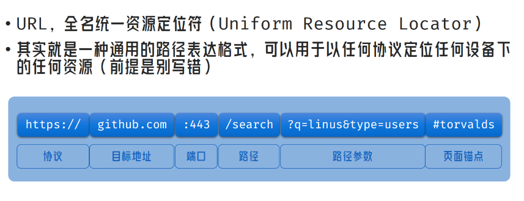
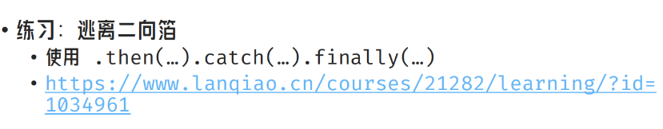

JS的网络请求

常见场景

端口号的主要作用是表示一台计算机中的<strong>特定进程</strong>所提供的服务。网络中的计算机是通过IP地址来代表其身份的，它只能表示某台特定的计算机，但是一台计算机上可以同时提供很多个服务，如数据库服务、FTP服务、Web服务等，我们就<strong>通过端口号来区别相同计算机所提供的这些不同的服务</strong>，如常见的端口号21表示的是FTP服务，端口号23表示的是Telnet服务，端口号25指的是SMTP服务等。

什么端口，其实自己理解才比较好，实战之后有了“感觉”再去看一些定义会理解的更彻底。

用户删除一个数据

web 点击按钮 => dom事件触发 => 执行请求函数 => 等待响应结果

​														发送JSON => 

后端 													接口 =>  处理 => 操作数据库 => 返回状态码

##### axios

##### json

stringify parse

##### Promise

异步编程

.then()  .catch() .finally()

await

案例:同步版本和异步

