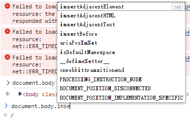
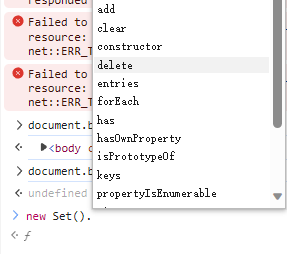

# 比赛技巧

## 巧用控制台

1. API怎么写忘了怎么办？

dom节点挂载的方法

Set实例的方法

##### 比较新的东西

requestAnimationFrame

otw

> 注意：正式考试是**不让检测直接提交代码**的，不是说看起来好像没问题或者功能实现感觉也对就能过检测然后得分的，如果你的思路不同于出题人的思路，就有可能检测失败。

例如[此题](https://www.lanqiao.cn/courses/21282/learning/?id=1031388&compatibility=false):如果忘了清除最下面一行的marigin-bottom，检测会失败，虽然看起来没问题

如果没有一个较好的程序设计，也可能因为比较偏门的做法而检测失败。这就需要多去跟教程去写，学习别人的思路和设计。

##### 函数式编程（vue3 react）

纯函数：无论多少次输入相同输出一定相同

使用不改变自身的方法

##### 封装组件

