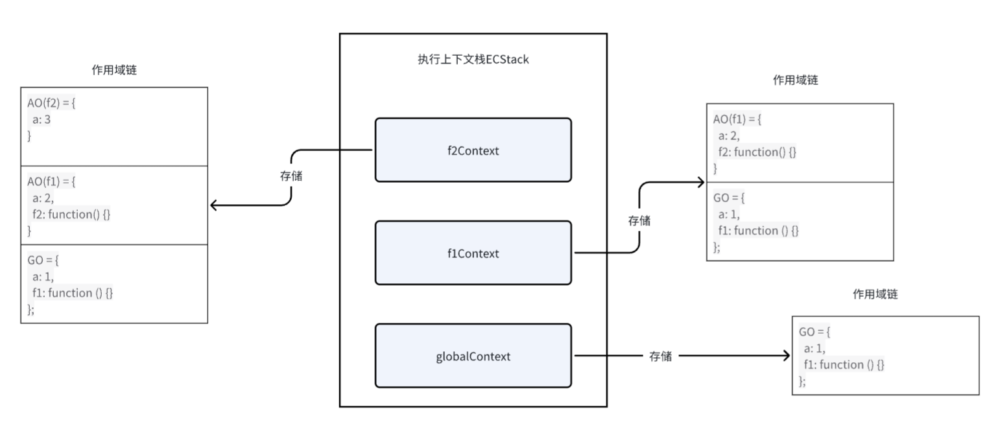

不知道你是否和我一样初学上下文、作用域链、闭包时被一堆概念搞的云里雾里，那么这次我就从实例的角度去把这些概念串起来，少扯概念、理论，层次递进，保证你能顺畅地从头看到尾，把这些知识弄清楚。

我们来看一段代码：

```js
var a = 1;
function f1() {
  var a = 2;
  function f2() {
    var a = 3;
    console.log(a);
  }
  f2();
}
f1();
```

JS 学过两天半就知道，打印的一定是 3，对吧？

但你有没有想过，JS 引擎为什么知道 a 是 3，其内部是如何组织这一层层变量的关系的？

## 在执行上下文层面

### 执行上下文

什么是执行上下文？

JS 引擎在遇到一段可执行代码后，会创建对应的`执行上下文`来决定它们可以访问哪些数据，以及它们的行为。

执行全局代码就创建`全局上下文`(globalContext)，执行函数就创建`函数上下文`。

a 这个变量，就放在上下文里，这样不同位置会有不同的上下文，也就会访问到不同的 a。

那么知道了上下文，我们怎么分析这段代码？

可以看到这段代码有`全局上下文`、有`函数上下文`，JavaScript 引擎创建了`执行上下文栈`（Execution context stack，ECS）来管理执行上下文。

### 管理执行上下文栈

当执行一个函数的时候，就会创建一个`执行上下文`，并且压入`执行上下文栈`，当函数执行完毕的时候，就会将函数的`执行上下文`从栈中弹出。

那么大致的处理流程如下：

```js
// 这里假设执行上下文栈是一个数组

//开始执行代码！
ECStack.push(globalContext);

// f1()
ECStack.push(f1Context);

// f1中调用了fun2，还要创建f2的执行上下文
ECStack.push(f2Context);

// f2执行完毕
ECStack.pop();

// f1执行完毕
ECStack.pop();
```

同时可以发现，ECStack 里面永远有个`globalContext`，直到所有代码执行完毕。

```js
// ECStack的变化过程

ECStack=[globalContext]
        ->
        [f1Context,globalContext]
        ->
        [f2Context,f1Context,globalContext]
        ->
        [f1Context,globalContext]
        ->
        [globalContext]

```

所以当查找变量的时候，会先从当前上下文中查找，如果没有找到，就会从父级执行上下文的变量中查找，一直找到全局上下文。

在这段代码中，执行 f2 时直接就在自己的上下文`f2Context`中找到了 a，不需要再去全局上下文`globalContext`。

现在解释的通了，你可以退出了（

等等，现在我们理解了上下文，那么能否再深入一些，上下文是怎么存储这些东西的？

## 在作用域链层面

### 作用域链

我们把上下文作为一个对象，那么这个对象里面会有一个重要属性，叫作用域链。（不止这一个，其他本文不涉及）

当前上下文中可以访问的所有变量和函数都会保存在作用域中，把作用域组织起来或者说串起来的东西就是个作用域链（Scope Chain）。

我们来回看这段代码：

```js
var a = 1;
function f1() {
  var a = 2;
  function f2() {
    var a = 3;
    console.log(a);
  }
  f2();
}
f1();
```

### AO 和 GO

作用链会装两种东西，AO 和 GO：

AO(activation object)：在函数执行时创建，包含函数所需的变量和函数。

- 活动对象（AO）：在函数执行时创建，包含函数所需的变量和函数。例如，当执行函数 `f1` 时，会创建 `f1` 的活动对象；执行函数 `f2` 时，会创建 `f2` 的活动对象。

- 全局对象（GO）：在全局上下文中创建，包含了全局范围内的变量和函数。通常是 `window` 对象。全局上下文的变量和函数都会被添加到全局对象中。全局对象在整个代码执行期间都是唯一的，并且优先级最低，在作用域链的最末端。

那么执行 f1 时就会创建 f1 的 AO，执行 f2 时就会创建 f2 的 AO。

填充作用域链时，会先把父级的作用域链复制过来。那么 f1 的作用域链会先拿到全局的作用域链也就是[GO]，再放入自己的 AO(f1)；f2 的作用域链会先拿到 f1 的作用域链[AO1, GO]，放入自己的 AO(f2)。

作用域链保存在内部属性[[Scope]] 中。

我们可以分析出上下文的内容：

```
globalContext->[[Scope]] = [GO]
f1Context->[[Scope]] = [AO(f1), GO]
f2Context->[[Scope]] = [AO(f2), AO(f1), GO]
```

那么代码在查找变量时，会顺着这个作用域链从前往后找，前面的优先级大于后面的，如果找不到就报错。

AO(f2), AO(f1), GO 都存储了 a，查找变量的时候首先查找到了 AO(f2)的 a，所以是 3。

好了，解释清楚了，你可以点赞退出了（

## 在变量对象层面

等一等，我们可以继续深入。

### VO

现在可以告诉你，AO 和 GO 都是变量对象（Variable Object，VO）的具体实现形式，变量对象就可以理解为存储环境需要的变量的对象。

那么变量对象是怎么存储这些代码需要的变量的？

这里就要引入预编译了，在 JavaScript 代码执行前，JavaScript 引擎会进行预编译，这个过程会对整个文件进行预处理。预编译阶段会填充上下文的变量对象。

预编译发生在代码执行的前一刻，填充不同上下文的变量对象：

- 在全局代码执行前，填充全局对象（GO）。
- 在函数执行前，填充函数的活动对象（AO）。

让我们来看预编译阶段具体是如何填充变量对象的：

### 全局上下文预编译

1.  **变量声明提升，但不赋值**
2.  **函数声明提升并赋值**

我们又来回看这段代码：

```js
var a = 1;
function f1() {
  var a = 2;
  function f2() {
    var a = 3;
    console.log(a);
  }
  f2();
}
f1();
```

可以分析出 GO 的填充过程：

```js
// 第一步，提升变量 a
GO = {
  a: undefined
};

// 第二步，提升并赋值函数 f1
GO = {
  a: undefined,
  f1: function () {}
};

// 预编译结束，执行代码
GO = {
  a: 1,
  f1: function () {}
};
```

### 函数上下文预编译

其实就是多了形参和实参的操作：

1.  **变量和形参声明提升，但不赋值**
2.  **实参值赋值给形参**
3.  **函数声明提升并赋值**

这里没有参数，所以流程大致相同。

对于 `f1` 函数：

```js
// 第一步，提升变量 a
AO(f1) = {
  a: undefined
}

// 第二步，提升并赋值函数 f2
AO(f1) = {
  a: undefined,
  f2: function() {}
}

// 预编译结束，执行代码
AO(f1) = {
  a: 2,
  f2: function() {}
}
```

对于 `f2` 函数：

```js
// 提升变量 a
AO(f2) = {
  a: undefined
}

// 预编译结束，执行代码
AO(f2) = {
  a: 3
}
```

需要注意的是，活动对象（AO）是临时的，函数执行完毕后就会被销毁。

## 流程梳理

到这里，`AO`和`GO`的内部我们也分析完成，让我们来梳理整个流程：

### 内部结构



### 运行过程

1.  **全局上下文**：

    - 预编译阶段生成 GO，GO 包含所有全局变量和函数。
    - 全局上下文入栈，GO 作为全局作用域。

2.  **执行 `f1`前一刻**：

    - 生成 `f1` 的函数上下文。
    - 预编译 `f1`，生成 AO(f1)，AO(f1) 包含 `f1` 的变量和函数声明。
    - AO(f1) 放入 `f1` 的作用域链，`f1` 的上下文入栈。

3.  **执行 `f2`前一刻**：

    - 生成 `f2` 的函数上下文。
    - 预编译 `f2`，生成 AO(f2)，AO(f2) 包含 `f2` 的变量和函数声明。
    - AO(f2) 放入 `f2` 的作用域链，`f2` 的上下文入栈。

4.  **执行代码**：

    - `f2` 执行，查找并打印变量 `a`，值为 `3`。
    - `f2` 执行完毕，`f2` 的上下文出栈。
    - `f1` 执行完毕，`f1` 的上下文出栈。
    - 全局代码执行完毕，全局上下文出栈。

通过以上步骤，我们可以看到 JS 引擎是如何通过执行上下文栈和作用域链，逐层查找变量并执行代码的。这样，即使遇到多层嵌套的函数调用，JS 引擎也能正确处理变量的查找和使用。

## 闭包

我们对这段代码稍作修改：

```js
var v = 1;
function f1() {
  var v = 2;
  function f2() {
    console.log(v);
  }
  return f2;
}
var f3 = f1();
f3();
```

JS 学过两天半就知道，打印的是 2，对吧？

不过，这次的情况有些不同，我们通过 f3 保存了 f1 返回的 f2，这个 f3 是在全局的上下文中执行，却打印了 f1 上下文中的变量，按理说 f1 已经执行完成，f1 的上下文和作用域链都该被销毁。

为什么会这样呢？这就是**闭包**的魔力。

### 什么是闭包？

闭包是指函数可以记住并访问它的词法作用域，即使函数在其词法作用域之外执行。闭包使得内部函数可以访问外部函数的变量，即使外部函数已经执行完毕。

```js
globalContext->[[Scope]] = [GO]
f1Context->[[Scope]] = [AO(f1), GO]
f2Context->[[Scope]] = [AO(f2), AO(f1), GO]
```

这段代码中，本该被销毁的 AO(f1)存储了内部的 v，但 f2 保留了对它的引用，外部调用 f3 实际调用 f2 时，还可以从 AO(f1)中找到 v。

闭包是一种现象，即内部函数引用了外部函数的上下文的变量，使得外部函数的上下文被保留。

说外部函数的上下文或者作用域都可以，可以理解为外部函数的上下文中的作用域。

**形成闭包**：内部函数使用了外部函数的变量会形成闭包。闭包保留了外部环境的引用。

**保存闭包：** 在外部保存了这个返回出去的内部函数。在外部函数执行完之后依然可以使用闭包里面的值。

### 闭包的应用

任何闭包的使用场景都离不开这两点：

- 创建私有变量
- 延长变量的生命周期

防抖节流、模块化都用到了闭包，都是在函数作用域内保存了自己所需的变量。
通过闭包实现模块化编程，可以有效避免全局变量污染，同时保证内部变量的私密性。

### 闭包可能的问题

如果不是某些特定任务需要使用闭包，在其它函数中创建函数是不明智的，因为闭包在处理速度和内存消耗方面对脚本性能具有负面影响。

#### 1. 内存泄漏

闭包会导致被引用的外部变量无法被垃圾回收，可能会引起内存泄漏，尤其是在大量使用闭包或长时间运行的应用中。

**示例**：

```
js
function createClosure() {
    let largeArray = new Array(1000000).fill('data');
    return function() {
        console.log(largeArray[0]);
    };
}

let closure = createClosure();
// largeArray 内存不会被释放
```

**解决方法**： 确保在不需要闭包时，手动解除对外部变量的引用。

```
js
function createClosure() {
    let largeArray = new Array(1000000).fill('data');
    return function() {
        console.log(largeArray[0]);
        largeArray = null; // 手动解除引用
    };
}

let closure = createClosure();
closure();
```

#### 2. 性能问题

由于闭包会持有对外部变量的引用，可能导致性能问题，特别是在频繁创建和销毁闭包的情况下。

**示例**：

```
js
function createClosures() {
    let closures = [];
    for (let i = 0; i < 1000000; i++) {
        closures.push(() => i);
    }
    return closures;
}

let closures = createClosures();
// 可能导致性能问题
```

**解决方法**： 在设计时尽量避免频繁创建和销毁闭包，可以通过调整代码结构或使用其他方法优化性能。

## 复杂的例子

这次用一个稍微复杂的例子，你能分别写出它的执行上下文栈变化过程、作用域链、变量对象(AO/GO)的填充过程吗？

```js
var a = 10;
function outer(b) {
  var c = 20;
  if (a) {
    var b = 2;
  }
  function inner(d) {
    function e() {}
    var e = 30;
    return function closure() {
      console.log(a + b + c + d + e);
    };
  }

  return inner;
}
var innerFunc = outer(5);
var closureFunc = innerFunc(15);
closureFunc();
```

**执行上下文栈（ECStack）的变化过程**

```js
ECStack = [globalContext]
        ->
        [outerContext, globalContext]
        ->
        [innerContext, outerContext, globalContext]
        ->
        [closureContext, innerContext, outerContext, globalContext]
        ->
        [innerContext, outerContext, globalContext]
        ->
        [outerContext, globalContext]
        ->
        [globalContext]


```

**作用域链（Scope Chain）**

```js
globalContext->[[Scope]] = [GO]
outerContext->[[Scope]] = [AO(outer), GO]
innerContext->[[Scope]] = [AO(inner), AO(outer), GO]
closureContext->[[Scope]] = [AO(closure), AO(inner), AO(outer), GO]

```

**变量对象（AO/GO）的填充过程**

GO 的填充过程

```
js
// 第一步，提升变量 a 和函数 outer
GO = {
    a: undefined,
    outer: function() {}
}

// 预编译结束，执行代码
GO = {
    a: 10,
    outer: function() {}
}
```

AO(outer) 的填充过程

```
js
// 第一步，提升变量 b 和 c
AO(outer) = {
    b: undefined,
    c: undefined,
    inner: undefined
}

// 实参值赋值给形参
AO(outer) = {
    b: 5, // 形参 b 被赋值为 5
    c: undefined,
    inner: undefined
}

// 第二步，提升并赋值函数 inner
AO(outer) = {
    b: 5,
    c: undefined,
    inner: function() {}
}

// 预编译结束，执行代码
AO(outer) = {
    b: 2, // 在 if 语句中重新赋值
    c: 20,
    inner: function() {}
}

```

AO(inner) 的填充过程

```js
// 第一步，提升变量 d 和 e
AO(inner) = {
    d: undefined,
    e: undefined,
    closure: undefined
}

// 实参值赋值给形参
AO(inner) = {
    d: 15, // 形参 d 被赋值为 15
    e: undefined,
    closure: undefined
}

// 第二步，提升并赋值函数 e 和 closure
AO(inner) = {
    d: 15,
    e: function() {},
    closure: function() {}
}

// 预编译结束，执行代码
AO(inner) = {
    d: 15,
    e: 30, // 在函数代码中重新赋值
    closure: function() {}
}


```

- `a = 10` (from GO)
- `b = 2` (from AO(outer))
- `c = 20` (from AO(outer))
- `d = 15` (from AO(inner))
- `e = 30` (from AO(inner))
- 输出 `10 + 2 + 20 + 15 + 30 = 77`

## 总结

1. js 引擎遇到可执行代码会创建对应的`执行上下文`，用来存储当前这块代码所需要的变量。
2. 执行上下文中存储着作用域链，即变量对象组成的一个链条，查找变量时会从前往后查找。
3. 内部函数引用了外部函数作用域的变量，这个作用域会被保留，就是闭包，闭包是一种现象。

好了，现在你应该基本理解了上下文、作用域链和闭包，喜欢就留个赞吧！

参考：

https://github.com/mqyqingfeng/Blog/issues/3

https://github.com/mqyqingfeng/Blog/issues/4

https://github.com/mqyqingfeng/Blog/issues/6

https://www.cnblogs.com/TomXu/archive/2012/01/13/2308101.html

https://vue3js.cn/interview/JavaScript/closure.html
