### 键位监听

监听指定按键，按下则亮，松开则暗。

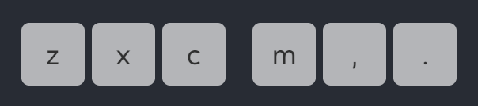

1. electron+py+eslint，没有用ts (成本问题)

2. 实现置顶无边框窗口拖拽

      注意：**drag与点击等默认事件冲突！**要点击的元素要设置 no-drag。

      实现共存必须自己手写拖拽功能：使用remote模块的BrowserWindow

3. python pynput监听系统级键盘事件，用ws给electron进程发消息哪些被按下

4. 节流实现CPS(次/秒)计算

5. Electron 主进程中，使用 `child_process` 模块启动 Python 进程

### MD2HTML：一个轻量的 `Markdown` 转 `HTML` 的 CLI 工具

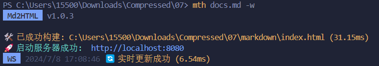

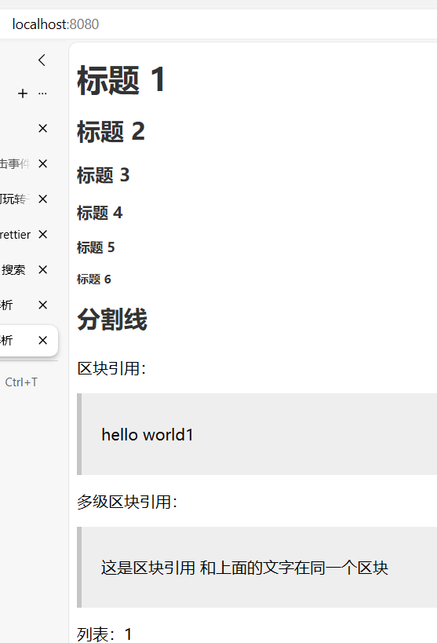

在命令行将 `Markdown` 转为 `HTML` ，支持通过参数或配置文件启用 `HMR` 监听模式、注入自定义的 `HTML` 模板、指定端口号和输出位置等功能。

 `pnpm worksapce` 管理 `monorepo` ，分`@md2html/cli`、`@md2html/core`、`@md2html/shared` 三个模块，`tsup` 打包。

**@md2html/cli**：

1. 检查、解析参数；加载、合并配置项；将内容转换后写入HTML；使用 `express` 开启监听服务器。
2. `HMR`：`chokidar`监听文件变动，`websocket`发消息给页面通知更新，页面收到消息刷新。
3. 开发`tsup`插件， 实现`build` 时自动将 `template/` 复制到 `dist/`。

**@md2html/core**：

1. 使用正则表达式进行基本的转换，转换为一个虚拟DOM树后统一渲染为HTML文本返回。
2. 使用 `vitest` 进行单元测试，使用快照测试来测试含大量数据的用例，并测试覆盖率。

**@md2html/shared**：

1. 封装 `file` 相关操作，使用 `chalk` 库封装 `logger`等。

### create-atri：个人项目脚手架CLI

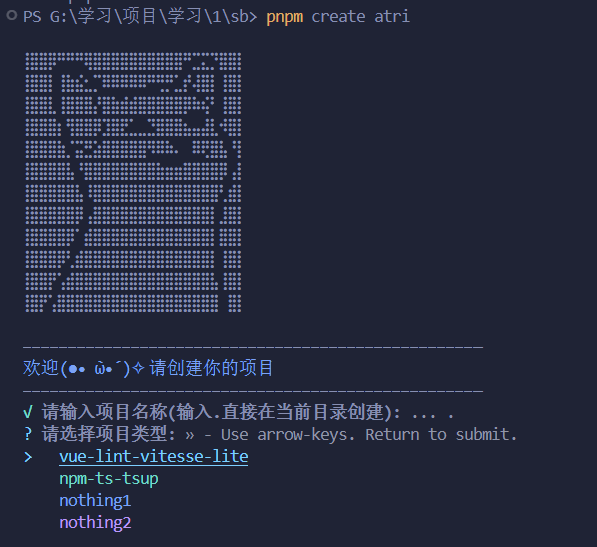

pnpm create atri

一个用于下载模板的脚手架，使用ts degit tsup chalk prompts

1. 用github管理模板，而不是内聚在cli里面，好处：

    1. cli只负责管理模板，模板的更新在模板的仓库操作

    2. 减少cli体积，用时再下载对应的包，并自带缓存机制

    3. 可以直接在cli里添加别人的模板收藏起来

2. 使用degit拉取模板，不会有模板自己的git记录

3. tsup打包 NPM Script封装dev命令：打包完成后自动npm link

`"dev": "tsup --watch --onSuccess \"npm link\""`

4. 设计方面：

    1. degit没有ts支持，自己写degit.d.ts

    2. 把常量抽离到另一文件，功能全部封装封装封装

    3. 支持输入'.'后在当前目录创建

5. 搓了两个模板：

    1. vue-lint-vitesse-lite：vitesse-lite:(vue3 ts vite unocss eslint lint-staged husky taze)基础上修改了eslint配置、项目结构、新增pinia

    2. npm-ts-tsup：开发包模板，内置tsup ts vitest

优化的小地方：

- 补充完整了package.json

- 让猫没那么别扭

- 常量、对应关系拆的很清楚

### cz-official：创智工作室官网 - [线上地址](http://1.92.82.236:7001/)

前端 `Vue3` + `Vite` + `TypeScript` + `UnoCSS` + `Pinia` + `ant-design`

后端 `NestJS` + `MySQL` + `Prisma` + `TypeScript`

1. **后端**：使用 `NestJS` 框架，完成相关接口，并添加参数校验、权限校验，使用 `JWT` 进行身份验证等。

2. **后台管理系统**：二次封装 `axios` 、封装 `UserModal` 命令式组件，以及常用 `Hooks` ，辅助完成各数据管理页。

3. **主页**：`gsap` 构建首页动画效果、封装 `useGlobalComps` 使用全局组件、`useMessage.tsx` 二次封装 `Message` 组件等，完成各数据展示页。

4. **文档库**：使用 `vitepress` 搭建静态文档库，并编写相应的前端教程内容，已上线至 [创智学习资源库](http://1.92.82.236:5173/)。

以及：

- 分析整合需求，写项目文档，策划项目架构设计、管理项目进度看板等；编写 `README` 文档，帮助他人快速上手开发；审查组内同学代码。使用 `ESLint` + `lint-staged` 进行代码规范约束。
- 使用 `GitHub Actions` 完成自动化部署：在推送或合并分支后，自动将打包好的文件通过 `SSH`上传至服务器目标路径。

### electron 迷你音乐播放器

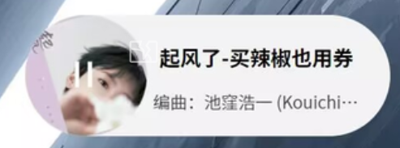

无说明

### mini-vue-ms：ts手写vue3源码

ts手写还原vue3源码，参考mini-vue和vuejs设计与实现。
目前已完成响应式系统

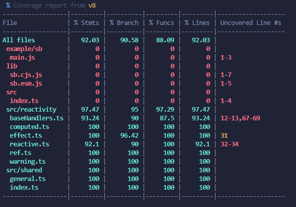

### SFC-live-server：VSC插件

一个VSC插件，模拟快速原型开发（现已弃用），可以选中一个单文件组件单独显示在页面上，同时支持热更新。

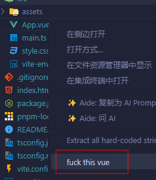

### HXM-Resume：初版个人简历网站

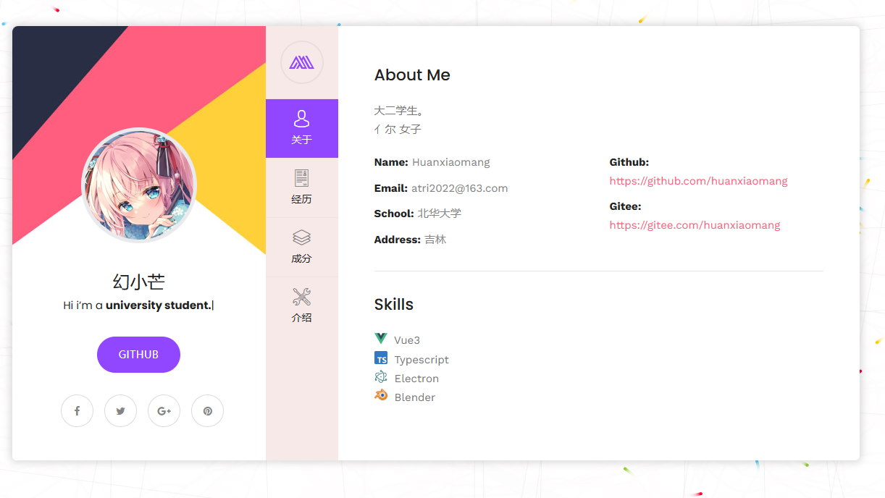

### package-analyser：NPM包分析工具

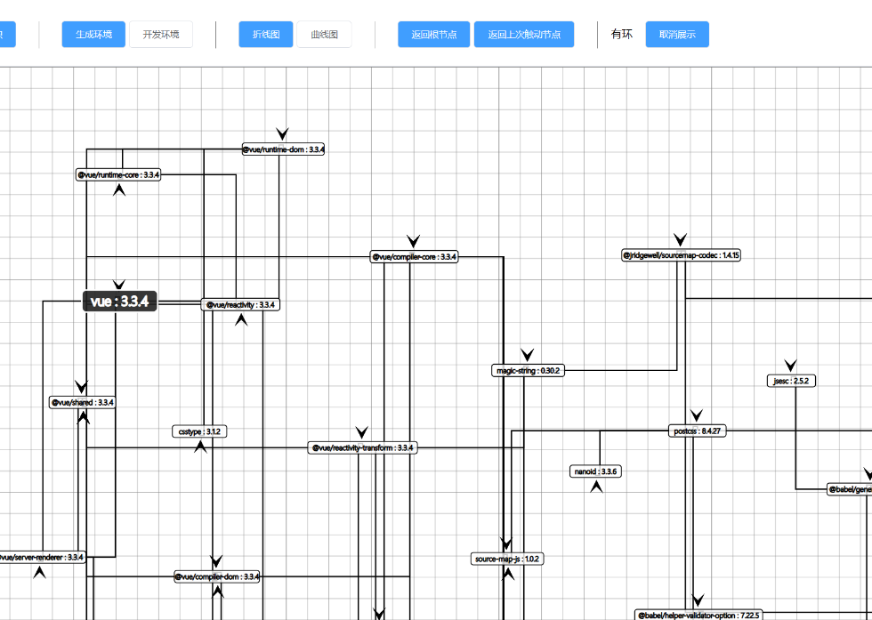

支持2D、3D视图

[Jackson-Mseven/package-analyser: NPM 包分析工具 (github.com)](https://github.com/Jackson-Mseven/package-analyser)

非常好字节青训营 使我全方位提升

### tdesign-mobile-starter：TDesign 移动端模板

TDesign (腾讯开源组件库) 移动端模板

[jianyi-gronk/tdesign-mobile-starter (github.com)](https://github.com/jianyi-gronk/tdesign-mobile-starter)

非常好腾讯犀牛鸟，使我开源能力提高

### CZDN：初代创智网站

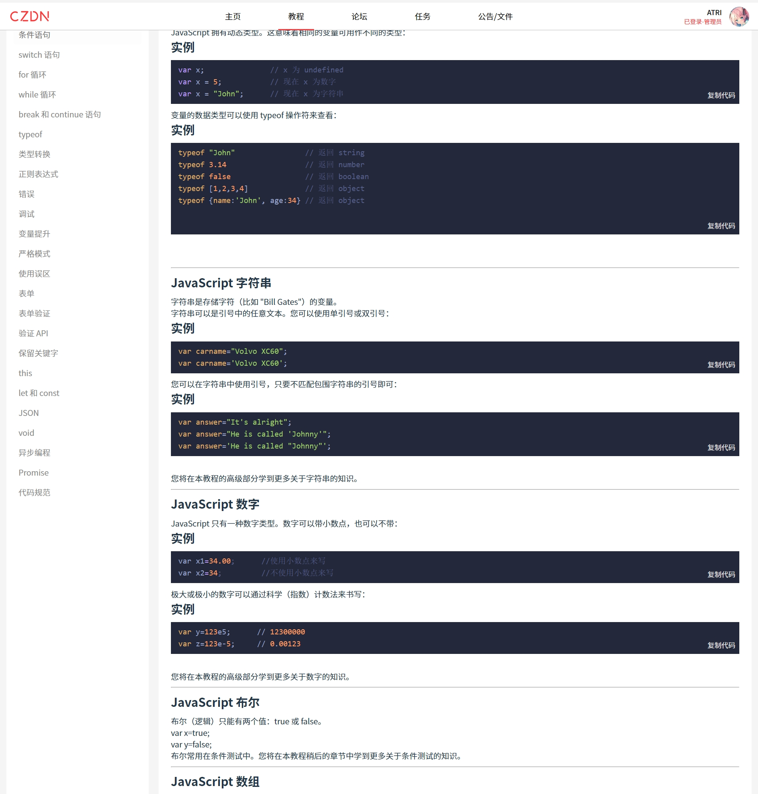

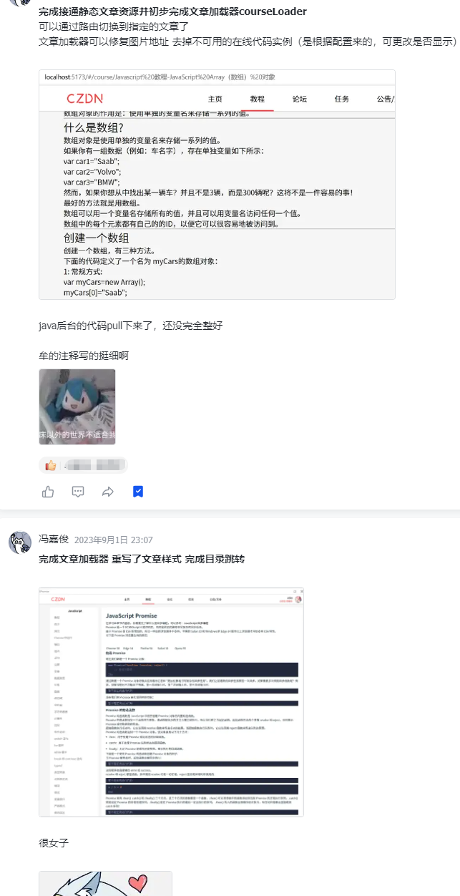

非常好CZDN，使我开发能力、程序设计能力提升
