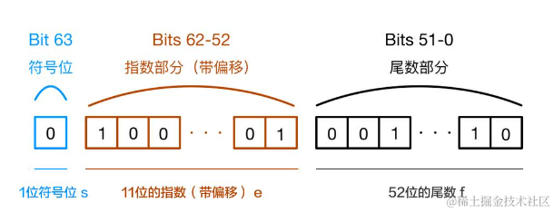

今天我们来深度解析JS8大数据类型，希望通过本文的学习，能够让大家彻底明白相关知识点，能够一次性搞定面试中遇到的大部分有关JS数据类型的问题。

本文将解决以下问题：

1.  为什么不能直接写`1.toString`？
2.  `0.1+0.2`为什么不等于`0.3`？有几种方法解决？
3.  `parseInt`知多少？`["1", "2", "3"].map(parseInt)`为啥输出`[1, NaN, NaN]`？
4.  `toFixed`的“四舍五入”真的靠谱吗？
5.  `BigInt`用来解决什么问题？
6.  怎么判断一个值是不是`NaN`？什么时候`NaN`可以等于自身？
7.  知道`isNaN`和`Number.isNaN`吗？
8.  `Math.min()`和`Math.max()`谁大？为什么？

点个赞，跟我一起查漏补缺吧！


开始之前我们复习一下JS的数据类型都有什么：

# JS8种数据类型

### 七种原始类型

1.  **布尔值（Boolean）** ：表示真值或假值，仅有两个取值：`true` 和 `false`。
2.  **null**：表示空值的特殊关键字，指示变量未包含任何有效值。
3.  **undefined**：表示变量尚未被赋值的状态。
4.  **数字（Number）** ：包括整数和浮点数，例如：`42` 或 `3.14159`。
5.  **BigInt**：用于存储和操作大整数，即使超过了Number类型的安全整数范围。
6.  **字符串（String）** ：表示文本数据，例如："Hello, world!"。
7.  **符号（Symbol）** ：表示独一无二且不可变的值，通常用于对象属性标识符。

### 复杂类型

8.  **对象（Object）** ：用于存储键值对和更复杂的实体。

# Number

## Number()

*   [`Number()`](https://developer.mozilla.org/zh-CN/docs/Web/JavaScript/Reference/Global_Objects/Number/Number)

    创建一个新的 `Number` 值。

如果参数不是`Number`类型，会进行类型转换。

不过当 `Number` 作为一个构造函数（用 `new`）被调用时，它会创建一个 `Number` 对象，该对象**不是**一个原始值。

例如，`typeof new Number(42) === "object"`，并且 `new Number(42) !== 42`（尽管 `new Number(42) == 42`）。

## 数字字面量

### 简写

*   **省略前导零的小数**:

    *   你可以省略小数点前的零。也就是说，`.1` 等同于 `0.1`。
    *   例如：`.5` 等同于 `0.5`。

*   **省略小数点后的零**:

    *   如果一个数字是整数，但你想要明确它是一个浮点数，可以在数字后面加上小数点和零。
    *   例如：`2.` 等同于 `2.0`。

对于`1.toString`，JS会把`.`后面的内容解析成小数，所以就会报错。

解决方案有很多：

```js
(1).toString(); // "1" 最通俗的方案

1 .toString(); // "1"  强迫症可能会难受(?

let num = 1; num.toString(); // "1"

1.0.toString(); // "1"    把小数点先用掉也可以
1..toString(); // "1"     省略小数点后的零
```

### 进制

*   **十进制（Decimal）**

    *   默认的数字表示法，不需要前缀。
    *   示例: `42`

*   **二进制（Binary）**

    *   使用前缀 `0b`。
    *   示例: `0b101010`（表示十进制的 42）

*   **八进制（Octal）**

    *   使用前缀 `0o`。
    *   示例: `0o52`（表示十进制的 42）
    *   旧版表示法（不推荐，在严格模式下无效）: 使用前缀 `0`。
    *   示例: `052`（表示十进制的 42）

*   **十六进制（Hexadecimal）**

    *   使用前缀 `0x`。
    *   示例: `0x2A`（表示十进制的 42）

示例：

```js

let decimal = 42;
let binary = 0b101010;
let octal = 0o52;
let hexadecimal = 0x2A;

console.log(`Decimal: ${decimal}`);       // 输出: Decimal: 42
console.log(`Binary: ${binary}`);         // 输出: Binary: 42
console.log(`Octal: ${octal}`);           // 输出: Octal: 42
console.log(`Hexadecimal: ${hexadecimal}`); // 输出: Hexadecimal: 42
```

八进制那里是个坑，默认没有采用严格模式时，`01`或者`010`这种数既可以表达八进制也可以表达十进制，由于历史原因被保留了。更好的做法是不要再用`0`做前缀了。

## parseInt()

**parseInt(*string*, *radix*)**  解析一个字符串并返回指定基数的十进制整数，`radix` 是 2-36 之间的`整数`，表示**被解析字符串**的基数。

*   如果 `radix` 为 10，表示将字符串解析为十进制数。
*   如果 `radix` 为 8，表示将字符串解析为八进制数，例如 "07"。
*   如果 `radix` 为 16，表示将字符串解析为十六进制数，例如 "0xff"。

注意，`radix` 是被解析字符串的基数，而不是期望结果的基数。函数返回的是转换后的十进制整数。

如果 `radix` 指定为 `0` 或未指定，函数会根据字符串的前缀自动推断基数。例如，"0x" 前缀表示十六进制，"0" 前缀表示八进制（在严格模式下八进制不被支持，可能与十进制弄混）。

### 进制转换

*   **十进制转二进制**：使用 `num.toString(2)` 方法。

*   **二进制转十进制**：使用 `parseInt(num, 2)` 方法。可别写成 `10`。

### parseInt()与map()

\["1", "2", "3"].map(parseInt)为啥输出\[1, NaN, NaN]？

我们期望输出 `[1, 2, 3]`, 而实际结果是 `[1, NaN, NaN]`.

`parseInt` 函数通常只使用一个参数，但实际上可以传入两个参数。第一个参数是要解析的字符串，第二个参数是基数。当在 `Array.prototype.map` 的回调函数中使用 `parseInt` 时，`map` 方法会把元素传入第一个参数，并把索引传入第二个参数。

```js
// parseInt(string, radix) -> map(parseInt(value, index))
/* 第一次迭代 (index 是 0): */ parseInt("1", 0); // 1 自动推算为10进制
/* 第二次迭代 (index 是 1): */ parseInt("2", 1); // NaN 不接受1进制，转不了，返回NaN
/* 第三次迭代 (index 是 2): */ parseInt("3", 2); // NaN 2进制不可能有3，转不了，返回NaN

```

为了正确处理，可以使用箭头函数或匿名函数来确保 `parseInt` 只接收一个参数：

```js
["1", "2", "3"].map(num => parseInt(num)); // 正确输出 [1, 2, 3]
```

或者使用 `Number` 构造函数：

```js
["1", "2", "3"].map(Number); // 正确输出 [1, 2, 3]
```

这样可以避免 `parseInt` 在 `map` 中的意外行为。

### parseInt()、parseFloat()、Number()

parseFloat()只有一个参数，不支持指定进制，可以将字符串形式的浮点数转换成数字类型的浮点数。

你可能会想，这不是跟`Number()`一样吗？

其实还是有区别的，在处理空串上面：

```js
parseInt('')
> NaN
parseFloat('')
> NaN
Number('')
> 0
```

说明`Number`遇到其他类型会进行类型转换，而`parseInt`、`parseFloat`不会。

## JS中数字精度问题

JavaScript 的 `Number` 类型是一个[双精度 64 位二进制格式 IEEE 754](https://zh.wikipedia.org/wiki/%E9%9B%99%E7%B2%BE%E5%BA%A6%E6%B5%AE%E9%BB%9E%E6%95%B8) 值，这意味着它可以表示小数值，但是存储的数字的大小和精度有一些限制。

IEEE 754 双精度浮点数使用 64 位来表示 3 个部分：




由于浮点数的有效数字部分（尾数）为 52 位，并且前面隐含一个 1，因此有效数字实际上是 53 位。有效数字部分范围在 1.0 到 2.0 之间。

既JS只有 （**-(2\*\*53 - 1)**） 到（**2\*\*53 - 1**）的容量去存储数字。这就是**最小安全整数**和**最大安全整数**。

### 超出安全整数范围导致运算不准确

当数值超出这个安全整数范围（即 `Number.MAX_SAFE_INTEGER` 和 `Number.MIN_SAFE_INTEGER`）时，JavaScript 中的算术运算会出现不准确的问题。例如：

```js
console.log(Number.MAX_SAFE_INTEGER); // 输出: 9007199254740992
console.log(Number.MIN_SAFE_INTEGER); // 输出: -9007199254740992

console.log(9007199254740991 + 1); // 输出: 9007199254740992
console.log(9007199254740991 + 2); // 输出: 9007199254740992
```

以上代码中，9007199254740991 是最大的安全整数，再加 1 和再加 2 的结果都一样，说明加 2 时运算不准确。

为了解决这个问题，可以使用 `BigInt` 类型来处理大整数。`BigInt` 是一种内置对象，它可以表示任意大的整数。你可以通过在数字后面加 `n` 或使用 `BigInt` 函数来创建 `BigInt`（但不能使用`new BigInt`）：

```js
const bigInt1 = 9007199254740991n;
const bigInt2 = BigInt("9007199254740991");

console.log(bigInt1 + 1n); // 输出: 9007199254740992n
console.log(bigInt1 + 2n); // 输出: 9007199254740993n
```

使用 `BigInt` 时需要注意以下几点：

1.  `BigInt` 不能与 `Number` 类型混合运算，如果需要混合运算，必须显式转换类型。
2.  `BigInt` 不适用于浮点数运算，它只能处理整数。
3.  `BigInt` 会影响性能，因为它是通过软件实现的，速度会比硬件加速的双精度浮点数慢。

下面是一个示例，演示如何使用 `BigInt` 处理超出最大安全整数范围的数值：

```js
const largeNumber1 = BigInt("9007199254740991000");
const largeNumber2 = BigInt("12345678901234567890");

const sum = largeNumber1 + largeNumber2;
const product = largeNumber1 * largeNumber2;

console.log(`Sum: ${sum}`);         // 输出: Sum: 21352869455975557980n
console.log(`Product: ${product}`); // 输出: Product: 111146322982670939112635269000000000000n
```

这样就可以准确处理任意大小的整数运算。

### 精度不够导致浮点数运算不准确

任何占用位数有限的数字编码系统，无论你选择的是十进制还是二进制，都**必定**无法精确表示所有数字，**因为你试图使用有限的内存来表示数轴上无限数量的点**。

例如，十进制系统无法准确表示 1/3，而二进制系统无法准确表示 `0.1`。因此，例如，`0.1 + 0.2` 并不完全等于 `0.3`：

```js
console.log(0.1 + 0.2); // 0.30000000000000004
console.log(0.1 + 0.2 === 0.3); // false

```

将其转换为二进制可以发现是**无限循环**，肯定超出了精度

```js
0.1.toString(2)
> '0.0001100110011001100110011001100110011001100110011001101'
0.2.toString(2)
> '0.001100110011001100110011001100110011001100110011001101'
```

底层使用二进制计算时，浮点数转换二进制是不准确的，二进制进行相加也是不准确的，转换回十进制还是不准确的。

因此，通常建议**不要直接使用 `===` 比较浮点数**。

另一种方法是将浮点数乘以一个大数将其转换为整数再进行比较，这在某些情况下也非常有用：

```js
// 使用乘以大数的方法进行比较
function areAlmostEqualWithPrecision(a, b, precision = 1e12) {
    return Math.round(a * precision) === Math.round(b * precision);
}
console.log(areAlmostEqualWithPrecision(0.1 + 0.2, 0.3)); // 输出: true
```

或者可以使用专门处理高精度小数的库，例如 `decimal.js`。

## toFixed()

在使用 `toFixed` 去四舍五入的时候会出现一些奇怪的问题如下：

```js
0.155.toFixed(2)
> '0.15'
0.255.toFixed(2)
> '0.26'
```

实际上，`toFixed` 函数对于四舍五入的规则与数学中的规则不同，而且**并不是使用的网上所说的银行家舍入规则**（四舍六入五考虑，五后非零就进一，五后为零看奇偶，五前为偶应舍去，五前为奇要进一），而是有一定的规则，具体可以查看这篇文章：[toFixed四舍五入的不准确性 (opens new window)](https://juejin.cn/post/6927215610552123406)。

其实 `toFixed` 不准确的根本原因是精度问题，比如：1.005.toFixed(2) 返回的是 1.00 而不是 1.01，原因： 1.005 实际对应的数字是 1.00499999999999989，在四舍五入时全部被舍去！具体查看：[JavaScript 浮点数陷阱及解法(opens new window)](https://github.com/camsong/blog/issues/9)

很显然，这并不是我们想要的结果。我们可以用浏览器提供的 Intl.NumberFormat 构造函数来格式化数字，它有很好的浏览器支持（包括 IE11），这里封装一个四舍五入的方法：

```js
// minimumFractionDigits 和 maximumFractionDigits 分别代表最小和最大小数位数，例如分别取 2，3，则 format(1.1) 则为 1.10，format(1.1111) 则为 1.111
function roundFloat (value, decimal = 2) {
  const formatter = new Intl.NumberFormat('en-US', {
    minimumFractionDigits: decimal,
    maximumFractionDigits: decimal,
  });
  return formatter.format(value);
}
```

## **`Number.EPSILON`** 

**`Number.EPSILON`** 静态数据属性表示 1 与大于 1 的最小浮点数之间的差值。可以用来表示比较时允许的误差。

使用`Number.EPSILON`解决0.1+0.2的问题：

```js
function equal(x, y) {
  return Math.abs(x - y) < Number.EPSILON;
}

const x = 0.2;
const y = 0.3;
const z = 0.1;
console.log(equal(x + z, y)); // true

```

除了数量级之外，考虑输入的*精度*也非常重要。例如，如果数字是从表单输入收集的，并且输入值只能以 `0.1` 的步长调整（即 [`<input type="number" step="0.1">`](https://developer.mozilla.org/en-US/docs/Web/HTML/Attributes/step "此页面目前仅提供英文版本")），通常可以允许更大的容差，例如 `0.01`，因为数据的精度只有 `0.1`。

**所以不要简单地一律将 `Number.EPSILON` 作为相等性测试的阈值**。而是使用适合要比较的数字的数量级和精度的阈值，即这个阈值是可以变通的。

```js
function areAlmostEqual(a, b, epsilon) {
    return Math.abs(a - b) < epsilon;
}

// 示例：对于数值较大的比较
let largeNumber1 = 1000000.1;
let largeNumber2 = 1000000.2;
let epsilonLarge = 0.1;
console.log(areAlmostEqual(largeNumber1, largeNumber2, epsilonLarge)); // 输出: true

// 示例：对于数值较小的比较
let smallNumber1 = 0.0000001;
let smallNumber2 = 0.0000002;
let epsilonSmall = 0.0000001;
console.log(areAlmostEqual(smallNumber1, smallNumber2, epsilonSmall)); // 输出: true

```

`epsilonLarge` 和 `epsilonSmall` 分别根据数值的数量级和需要的精度设定，而不是简单使用 `Number.EPSILON`。

## Math.min()和Math.max()谁大

这里顺带说一下这个面试题，`Math.min()`不传参默认返回`Infinity`，`Math.max()`不传参默认返回`-Infinity`。

不过很少人说过为什么，这里大概讲一下：

`Math.min()`内部首先会保存一个值，我们假设他是N，然后迭代传入的参数，如果小于N，那就更新N，最后把这个N返回出去。

那么N的初始值当然要选`Infinity`，**因为任何数都比`Infinity`小，这样才能更新**。如果是-`Infinity`迭代到最后还是`-Infinity`。

那么不传参的情况下，N不会被迭代时更新，最后当然返回初始值：`Infinity`。

`Math.max()`同理。

## NaN

## NaN的特性

`NaN` 也属于 `number` 类型，`NaN` 属性的初始值就是 NaN，和 [`Number.NaN`](https://developer.mozilla.org/zh-CN/docs/Web/JavaScript/Reference/Global_Objects/Number/NaN) 的值一样。

[`NaN`](https://developer.mozilla.org/zh-CN/docs/Web/JavaScript/Reference/Global_Objects/NaN)（“**N**ot **a** **N**umber”）是一个特殊种类的数值，当算术运算的结果不表示数值时，通常会遇到它。它也是 `JavaScript` 中**唯一**不等于自身的值。

借助这个特性，**如果一个值不等于自身，那么它就是NaN**。

同时JS还提供了`isNaN`和`Number.isNaN`函数来判断一个值是不是`NaN`：

```js
NaN === NaN;        // false
Number.NaN === NaN; // false
isNaN(NaN);         // true
isNaN(Number.NaN);  // true
Number.isNaN(NaN);         // true
Number.isNaN(Number.NaN);  // true
```

`NaN`表示`Not a Number`，会出现在涉及数字的函数传入了不可转换的参数时出现，如`parseInt('abc')`。

不过在`Object.is()`和零值相等中`NaN`可以等于自己:

```js
Object.is(NaN,NaN)
> true
```

零值相等可以详见我的另一篇文章：

[==、===、Object.is()区别？零值相等是什么？ - 掘金 (juejin.cn)](https://juejin.cn/post/7378836196033298473)

### Number.isNaN与isNaN的区别

注意 `isNaN()` 和 `Number.isNaN()` 之间的区别：如果当前值是 `NaN`，或者将其强制转换为数字后将是 `NaN`，则前者将返回 `true`。而后者仅当值当前为 `NaN` 时才为 `true`：

```js
isNaN('hello world');        // true
Number.isNaN('hello world'); // false
```

`isNaN` 会先用 `Number()`看能不能把参数转换为数字类型，然后再进行判断，但是 `Number.isNaN` 就不会做任何的隐式转换。

是不是有点熟悉？上文提到的`parseInt`、`parseFloat`也不会做任何的隐式转换。

参考：

[undefined与null的区别 - 阮一峰的网络日志 (ruanyifeng.com)](https://www.ruanyifeng.com/blog/2014/03/undefined-vs-null.html)

[开发者客栈-帮助开发者面试的平台-顽强网络 (developers.pub)](https://www.developers.pub/wiki/1065322/1230999)

[JavaScript 数据类型和数据结构 - JavaScript | MDN (mozilla.org)](https://developer.mozilla.org/zh-CN/docs/Web/JavaScript/Data_structures)

[NaN 的 注意点\_webots中限制nan-CSDN博客](https://blog.csdn.net/qq_45803050/article/details/127129335)

[JavaScript 数据类型和数据结构 - JavaScript | MDN (mozilla.org)](https://developer.mozilla.org/zh-CN/docs/Web/JavaScript/Data_structures)

[在 JavaScript 中，Math.max() 和 Math.min() 在不填入参数的情况下为什么返回 -INFINITY 与 INFINITY - PinkChampagne - 博客园 (cnblogs.com)](https://www.cnblogs.com/pinkchampagne/p/15351743.html)

