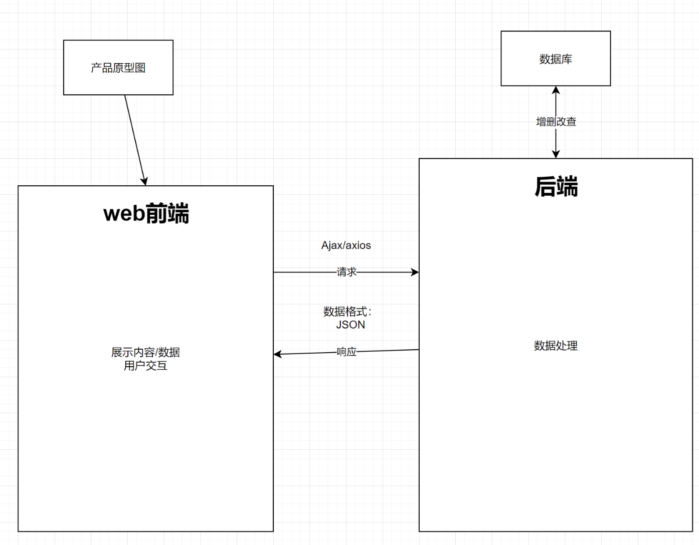

##### 前后端分离架构

 

前HTML CSS JS  axios => 后Springboot mybatis

mysql

宝塔

分离

##### 面向对象及面向对象思想

- 真不难！          

思想和语法                                                                                                                                                                                                                                                                                                                                                                                                                                                                                                                                                                                                                                    

语法基于思想，只要掌握了思想，你会发现很多东西就是理所当然的，之后即使再没写过java面向对象，也完全能理解并且实现面向对象思想的程序。

b站课https://www.bilibili.com/video/BV1Bq4y1j7Zz/

 

##### Springboot

难点

1. springboot的安装
2. springboot项目的启动

后面照着敲

  

