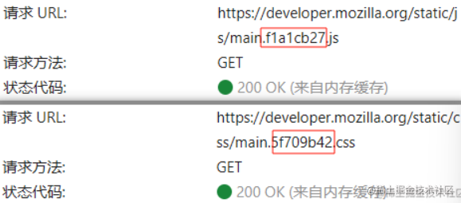

本文将解决以下问题：

1. 如何设置强缓存和协商缓存？
2. `Etag`和`Last-Modified`优劣对比？同时存在谁优先级高？
3. cache-control常见字段？no-store和no-cache区别？
4. 强缓存和协商缓存使用场景？
5. 怎么跳过强缓存使用协商缓存？


## HTTP 缓存


缓存会根据进来的请求保存输出内容的副本；当下一个请求来到的时候，如果是相同的 URL，缓存会根据缓存机制决定是直接使用副本响应访问请求，还是向源服务器再次发送请求。

为合适的资源创建缓存，可以加快页面打开速度、减少网络带宽、降低服务器压力等等。


强缓存（也称本地缓存）和协商缓存（也称弱缓存）是HTTP缓存的**两个阶段**：


1. 本地缓存阶段

浏览器发送请求前，会先去缓存里查看是否命中强缓存，如果命中，则直接从缓存中读取资源，不会发送请求到服务器。状态码表现为200 (`from disk cache`)。否则，进入下一步。


2. 协商缓存阶段

当强缓存没有命中时，浏览器一定会向服务器发起请求。服务器会根据 Request Header 中的一些字段来判断是否命中协商缓存。

如果命中，服务器会**返回 304 响应，但是不会携带任何响应实体**，只是告诉浏览器可以直接从浏览器缓存中获取这个资源。状态码表现为304。

未命中，直接从服务器加载资源。


**本地缓存 -> 协商缓存 -> 从服务器加载资源**

### 开启缓存

一种方法是使用 HTML Meta 标签，但用处很有限，还只有IE可以识别，现在都使用缓存有关的 HTTP 消息报头来开启缓存：

开启强缓存：Expires 或 Cache-Control

开启协商缓存：Last-Modified 或 ETag

### Expires & Cache-Control

强缓存是根据返回头中的 `Expires` 或者 `Cache-Control` 两个字段来控制的，都是表示资源的缓存有效时间。


**Expires**：HTTP1.0 的特性，标识该资源过期的时间点，它是一个绝对值，GMT格式的时间（**yyyy-mm-ddThh:mm:ss.xxx**），在此时间点后，缓存的资源过期。

缺点：使用的是**绝对时间**，如果服务端和客户端的时间产生偏差，那么会导致命中缓存产生偏差。现在大多数使用`Cache-Control`替代，不过为了兼容性会同时设置两个头部。

**Cache-Control**：HTTP1.1 的特性，为了弥补 Expires 缺陷加入的，提供了更精确细致的缓存功能。

常见的指令：

-   `private`：只有用户自己的浏览器能够进行缓存，公共的代理服务器不允许缓存
-   `public`：缓存的版本可以被代理服务器或者其他中间服务器识别
-   **`max-age=t`：缓存内容将在t秒后失效**。当在首部字段`Cache-Control` 有指定 `max-age` 指令时，比起首部字段 Expires，会优先处理 `max-age` 指令。
-   `no-cache`：需要使用协商缓存来验证缓存数据，可以在客户端存储资源，每次都必须去服务端做新鲜度校验，来决定从服务端获取新的资源（`200`）还是使用客户端缓存（`304`）
-   `no-store`：所有内容都不会缓存，永远都不要在客户端存储资源，永远都去原始服务器去获取资源


**注意1：no-cache不是不缓存，`no-store`才是不缓存！**

**`no-cache`的意思是不使用强缓存但不是不缓存**，每次用应该去向服务器验证缓存是否可用。

**注意2：不设置Expires和Cache-Control不一定就是不缓存！**

就算 Response Header 中沒有设置 Cache-Control 和 Expires，浏览器仍然会缓存某些资源，这是浏览器的默认行为，是为了提升性能进行的优化，每个浏览器的行为可能不一致，有些浏览器甚至没有这样的优化。

浏览器默认缓存策略：

修改img的src属性刷新图片时，如果图片地址相同，图片无变化。

明明自己没有设置强缓存，但被浏览器默认的缓存策略处理了，只需要加个随机后缀就好。

### Last-Modified & Etag

**Last-Modified**：Last-Modified(Response Header)与 If-Modified-Since(Request Header)是一对报文头，属于 http 1.0。值是GMT时间。

If-Modified-Since 是一个请求首部字段，并且只能用在 GET 或者 HEAD 请求中。Last-Modified 是一个响应首部字段，包含服务器认定的资源作出修改的日期及时间。

当带着 If-Modified-Since 头访问服务器请求资源时，服务器会对比Last-Modified 和 If-Modified-Since 的时间，如果Last-Modified更早（即资源没有更新），则会返回一个不带主体的 304 响应，否则将重新返回资源。

**Etag**：

Etag与 If-None-Match 是一对报文头，属于 http 1.1。

Etag 是一个响应首部字段，它是根据实体内容生成的一段 hash 字符串，标识资源的状态，由服务端产生。

If-None-Match 是一个条件式的请求首部。如果请求资源时在请求首部加上这个字段，值为之前服务器端返回的资源上的 Etag，如果匹配说明资源未更新，则返回不带实体的 304 响应。


Etag的优点：

a. Last-Modified 标注的最后修改只能精确到秒级，如果某些文件在 1 秒钟以内，被修改多次的话，它将不能准确标注文件的新鲜度；

b. 某些文件也许会周期性的更改，但是他的内容并不改变(仅仅改变的修改时间)，但 Last-Modified 却改变了，导致文件没法使用缓存；

c. 有可能存在服务器没有准确获取文件修改时间，或者与代理服务器时间不一致等情形。

Etag的缺点：

实际应用中`Etag`的计算是使用算法来得出的，而算法会占用服务端计算的资源，不能无脑使用。


Etag 优先级比 Last-Modified 高，同时存在时会**以 Etag 为准**。（因为用Etag的值做判断更可信）。


## 缓存应用场景


-   对于某些不需要缓存的资源，可以使用 `Cache-control: no-store` ，表示该资源不需要缓存
-  ** 对于频繁变动的资源，可以使用 `Cache-Control: no-cache` 并配合 `ETag` 使用**，表示该资源已被缓存，但是每次都会发送请求询问资源是否更新
-   **对于代码文件来说，通常使用 `Cache-Control: max-age=31536000` 并配合策略缓存使用**，然后对文件进行指纹处理，一旦文件名变动就会立刻下载新的文件。

**对于css、js这些静态的代码文件打包后在文件名携带hash值**：




-   对于不常变动的如网站logo，可以设置强缓存。


我们来看这个chrome插件的例子，这是它的响应标头：


```js
Access-Control-Allow-Origin: *

Cache-Control: no-cache

Content-Security-Policy: script-src 'self'; object-src 'self'

Content-Type: text/javascript

Cross-Origin-Resource-Policy: cross-origin

Etag: "VS2BqyeVJ0kXFGnZ6XsvdvD4IBo="

Last-Modified: Tue, 09 Jul 2024 09:20:26 GMT
```

不熟悉的可能会想，no-cache这好像是不缓存啊？

上面我们提到过，Cache-Control: no-cache表示**不使用强缓存，直接跳过本地缓存阶段**：浏览器在每次请求该资源时都必须向服务器发送请求以验证缓存的内容，而不是直接从本地缓存中读取。

设置Etag和Last-Modified表示使用协商缓存。

可能还有人会想，那我不使用强缓存的话我直接不设置Cache-Control不就好了吗？

不一定。上面提到过，没有 `Cache-Control`或`Expires`浏览器会尝试采用默认的缓存策略，但这种行为不太可预测且依赖于具体浏览器实现。

所以：

- 添加Etag和Last-Modified来使用协商缓存，不添加不使用。

- 添加Expires和Cache-Control来使用强缓存，**设置Cache-Control: no-cache不使用强缓存。** no-cache就是来干这个的。


参考：

[彻底弄懂浏览器缓存策略 | 机器之心 (jiqizhixin.com)](https://www.jiqizhixin.com/articles/2020-07-24-12)
<- 写的太好了！

[深入理解浏览器的缓存机制 · Issue #2 · Cosen95/blog (github.com)](https://github.com/Cosen95/blog/issues/2)

[阿里巴巴：浏览器的强缓存和协商缓存（一面） · Issue #29 · frontend9/fe9-interview (github.com)](https://github.com/frontend9/fe9-interview/issues/29)
