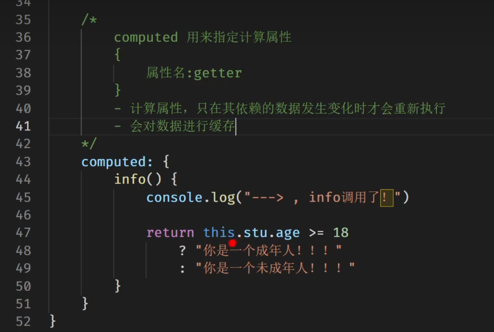
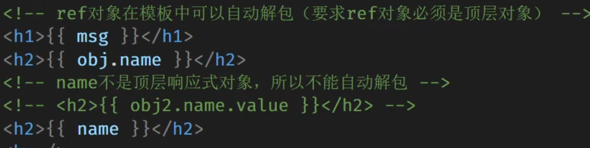
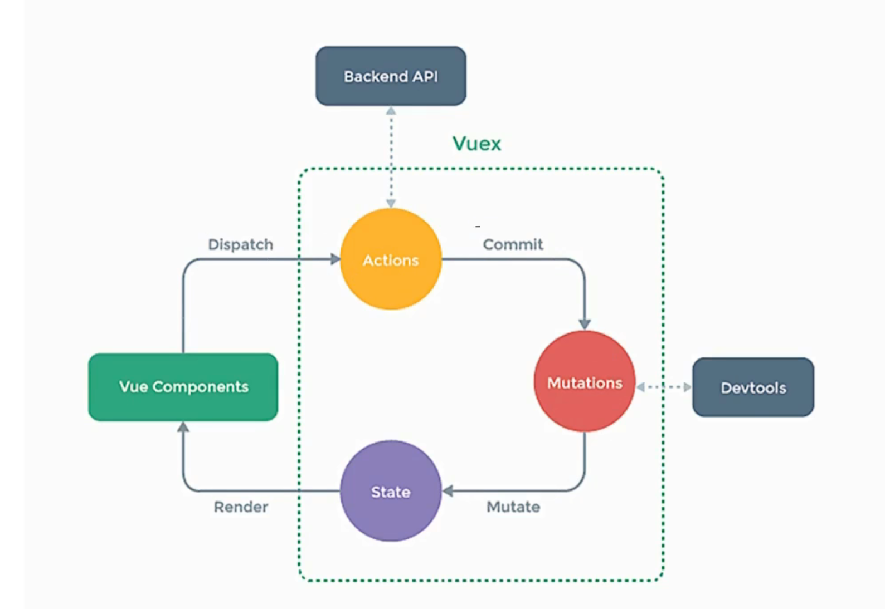

## 基本语法

##### 离谱操作

```javascript
        function template() {
            return `<ul>
                    ${lessons.map((item) =>
                links`<li>作者：${item.author},课程：${item.title}</li>`
            ).join("")}
                    </ul>
                    `
        }

        document.body.innerHTML += template();

        function links(strings, ...vars){
            console.log(vars);
        }
```


实时检测input内字数，不算空格

```javascript
<input type="text" name="password" id="">
    <script>

        let ps = document.querySelector("[name='password']");

        ps.addEventListener('keyup',function(){
            this.value = this.value.trim();
            console.log(this.value.trim().length);
        })
```


```js
        console.log(hd.slice(1,3)); //左闭右开范围
        console.log(hd.substring(-3)); //单纯表坐标，负数无意义自动变0
        console.log(hd.substr(1,3)); //左坐标右选取个数
```


##### forEach和reduce对比

reduce可以不污染全局作用域

```js
        let arr1 = [{ x: 1 }, { x: 2 }, { x: 3 }];

        let sum1 = 0;

        arr1.forEach((item)=>{
            sum1 += item.x;
        })

        console.log(sum1);

        const sum2 = arr1.reduce((acc,cur)=>{
            return acc + cur.x;
        },0)

        console.log(sum2);
```


##### 敏感词判断

```javascript
        //敏感词判断
        const words = ["php","nmsl"];

        const userString = "PHP你妈sl";

        const status = words.some((word)=>{
            return userString.toLowerCase().includes(word);
        })

        if(status){
            console.log("违禁");
        }
```


##### 敏感词判断PLUS 带自动替换

```js
    //敏感词判断
    const words = ["sb","nmsl"];

    const userString = "sbPHP,我不想学,nmsl,哈哈哈,nmsl";

   //大小写也要判断
    const status = words.some((word) => {
        return userString.toLowerCase().includes(word);
    })

    if (status) {
        console.log("违禁");
        console.log(rep(words,userString));
        
    }

    function rep(arr,userString){
        return arr.reduce((acc,word)=>{
             return acc.toLowerCase().replaceAll(word,"***");
        },userString)
    }
```


##### 数组排序

```js
    let grade =[1,3,6,234,3,323];

    console.log(Math.max(...grade));
```


##### 随机数函数

```js
    function random(a,b){
        return a + Math.floor(Math.random() * (b-a)) //是不是b-a+1取决于右区间是否闭
    }
```


##### 从数组中随机返回

```js
    function arrayRandom(arr,start = 1,end){
        end = end ? end : arr.length;
        start--;
        const index = start + Math.floor(Math.random() * (end - start));
        return arr[index];
    }
```


##### 封装日期格式化函数

```js
    function dateFormat(date, format = "YYYY-MM-DD HH:mm:ss") {
        const config = {
            YYYY: date.getFullYear(),
            MM: date.getMonth() + 1, //getMonth()返回0-11
            DD: date.getDate(),
            HH: date.getHours(),
            mm: date.getMinutes(),
            ss: date.getSeconds()
        }
        for(const key in config){
            format = format.replace(key,config[key]);
        }
        return format;
    }

    console.log(dateFormat(new Date(),"YYYY年MM月DD日"));
```


##### 牛逼的数组拼接

```js
    const arr = ['dad','sb'];
    let arrp = ['add','gdsg'];

    //1
    arrp.forEach((item)=>{
        arr.push(item);
    })
	//2
    for(const item of arrp){
        arr.push(item);
    }
	//3
    arr = [...arr,...hd];

    console.table(arr);
```


##### 牛逼的求和函数

```js
    function sum(...args){
        return args.reduce((acc,cur)=>{
            return acc + cur;
        },0)
    }
```


##### 三种方法操作DOM改颜色

```js
    Array.from(divs).map((item) => {
        item.style.color = "white";
    })

    Array.prototype.map.call(divs, (item) => {
        item.style.color = "white";
    })

    [...divs].map((item)=>{
        item.style.color = "white";
    })

		//牛逼的点一下改一下样式：toggle()方法
        [...divs].map((item)=>{
            item.addEventListener('click',function(){
                this.classList.toggle('hide');
            })
        })
```


### splice()啥都能干

```js
    arrnum.splice(1,2); //删2个
    arrnum.splice(1,1,'sb'); //替换
    arrnum.splice(1,0,'你好'); //增加
    table(arrnum)
```


##### 数组的复制

```js
        const newArray = array; //其实还是同一个
        const newArray = [...array]; //这是复制
```


##### 数组移动元素函数

```js
    function move(array, start, end) {
        if (start < 0 || end >= array.length) {
            console.error("参数错误");
            return;
        }
        const newArray = [...array]; //浅复制
        let item = newArray.splice(start, 1);
        newArray.splice(end, 0, ...item);
        return newArray;
    }

    log(move(arrnum, 3, 1));
```


##### 4种方法清除数组

```js
    arrnum = []; //一般，如果是被复制来的数组则不会清除原数组
    arrnum.length = 0;
    arrnum.splice(0,arrnum.length);
    while(arrnum.pop());
```


### 手写includes方法，indexOf和includes的区别

```js
    let num = [1,4,5,6,7,3,5];
    log(num.indexOf(2,5)) //索引值
    log(num.includes(0)) //布尔值

	//缺点：无法查找引用类型
    function includes(array,value){
        for(const n of array){
            if(value === n){
                return true;
            }
            return false;
        }
    }
```


##### 分割数组

```js
const splitArray = (oldArr, num) => {
    // TODO：请补充代码实现功能
    const newArr = [...oldArr.sort((a,b)=> a-b)];
    const retArr = [];
    for (let n = 0; n < newArr.length; n + (newArr.length / num)) {
        let item = newArr.splice(n, num);
        retArr.push(item);
    }
    return retArr;
};
```


##### 自定义find函数


```js
        function find(array,callback){
            for(const value of array){
                if(callback(value)) return value;
                return undefined;
            }
        }

        log(find(lessons,(item)=>{
            return item.author = "古老师";
        }))
```


##### 自定义sort函数

```js
    function sort(array,callback){
        for (const n in array) {
            for(const m in array){
                if(callback(array[n],array[m]) < 0){
                    const temp = array[n];
                    array[n] = array[m];
                    array[m] = temp;
                }
            }
        }
        return array;
    }
```


**for** **in** 遍历的是数组的索引（即键名），而 **for** of 遍历的是数组元素值 for in 总是得到对象的 key 或数组、字符串的下标 **for** **of** 总是得到对象的 value 或数组、字符串的值


注意数组中是值类型还是引用类型。of会复制其值，值类型不会改变原数组，引用类型会。

```js
        for(const m of array){
           	...
            }
```


nodelist转Array

```js
        log([...lis])
        log(Array.from(lis))
```


迭代器遍历数组

```js
    //迭代器
    let arr = [1, 2, 4, 6, 3, 6, 7, 3, 9, 5, 6];
    let values = arr.values();
    while ({ value, done } = values.next()) {
        if (done == true) break;
        log(value)

    }
```


```js
    for (const key of arr.keys()) {
        log(key)
    }

    for(const value of arr.values()){
        log(value)
    }

        for(const [key,value] of arr.entries()){
            log(value)
        }
```


##### every和some

some到true就停，every到false就停

1.some()方法，遍历数组的每一项，若其中一项为 true，则返回true；

2.every()方法，遍历数组每一项，若全部为true，则返回true；


判断输入框是否包含关键词

        let keywords = ['php', 'js'];


```js
    $("[type='text']")[0].addEventListener('keyup', function () {
        const status = keywords.some((keyword) => {
            // return this.value.indexOf(keyword) != -1; 两个方法
            return this.value.includes(keyword);
        })
        /*if (!status) {
            $('span')[0].innerHTML = '必须包含' + keywords.join(',') + '关键词'
        }else{
            $('span')[0].innerHTML = ''
        }*/
        
        //简写
        $('span')[0].innerHTML = status ? '' :'必须包含' + keywords.join(',') + '关键词'
    })
```


操作DOM分页

```js
//操作nodeList最好还是先转数组不然有莫名其妙的问题
Array.from($('.tabs div')).forEach((item, index, array) => {
    array[index].addEventListener('click', function () {
        let itemArray = $('#content div');
        for (const key in array) {
            array[key].classList.remove('active')
            itemArray[key].classList.remove('active')
        }
        this.classList.add('active');
        itemArray[index].classList.add('active')
    })
})
```


删除数组第一个元素的几个方法

```js
//妙啊
function curtail(arr) {
    const [,...rest] = arr;
    return rest
}

function curtail(arr) {
    return arr.slice(1,arr.length)
}
```


map()和forEach()

`forEach`适合于你并不打算改变数据的时候，而只是想用数据做一些事情 – 比如存入数据库或则打印出来。

`map()`适用于你要改变数据值的时候。不仅仅在于它更快，而且返回一个新的数组。这样的优点在于你可以使用复合(composition)(map(), filter(), reduce()等组合使用)来玩出更多的花样。


```js
function getNameByPrice(array, price) {
  return array.reduce((goods, elem) => {
    if (elem.price > price) {
      goods.push(elem);
    }
    return goods;
  }, []).map(elem => elem.name); //map用来快速获取name
}
```


DOM的箭头函数就别用this了捏

```js
        $('div')[0].addEventListener('click',(e)=>{
            console.log(e.target);
        })
```


call/apply/bind的精华就在于改变了this，但是箭头函数没this


##### 封装请求函数，构造函数方法继承

```js
    function Request(params){
        this.get = function (params) {
            let arr = Object.keys(params).map((key)=>`${key}=${params[key]}`)
            return arr.join('&')
        }
    }

    function Article() {
        this.url = 'article/lists';
        Request.call(this);
    }
    
    let a = new Article();
    console.log(a.get({ id: 1, cat: 'js' }));
```


##### 排他思想和call方法

```js
    function panel(i) {
        let dds = $('dd');
        dds.forEach((dd) => {
            dd.setAttribute('hidden', 'hidden')
        })
        dds[i].removeAttribute('hidden');
    }

    $('dt').forEach((dt,i)=>{
        dt.addEventListener('click',()=>panel.call(null,i)) //不传this传index
    })
```


##### 随机改颜色

```js
    function Color(elem) {
        this.elem = elem;
        this.colors = ["#74b9ff", "#ffeaa7", "#fab1a0", "#fd79a8"];
        this.run = function () {
            setInterval(function () {
                let i = Math.floor(Math.random() * this.colors.length);
                this.elem.style.backgroundColor = this.colors[i];
            }.bind(this), 1000)
        }
    }

    let obj = new Color(document.body);
    obj.run();
```


### 手写call()方法

```js
    Function.prototype.myCall = function(){
        const args = Array.prototype.slice.call(arguments);
        //获取this
        const t = args.shift();
        const self = this;
        t.fn = self;
        //执行函数此时this变为t
        const res = t.fn(...args);
        delete t.fn;
        return res;
    }

    function fn(a,b){
        return this.x+a+b;
    }

    const res = fn.myCall({x:1},1,2);
    console.log(res);
```


改良版本

```js
    Function.prototype.myCall = function (obj,...rest) {
        obj = obj ? Object(obj) : window;
        const fn = Symbol('test');
        obj[fn] = this;
        const res = obj[fn](...rest);
        delete obj[fn];
        return res;
    }
```


##### 手写bind()

```js
    Function.prototype.myBind = function (obj, ...rest) {
        const fn = this;
        return function(...rest2){
            return fn.myCall(obj,...rest.concat(rest2))
        }
    }
```


##### 延伸函数环境生命周期

函数无用时会被销毁，每次调用函数都会新生成一个相应的作用域。只有把内层函数返回出去才能持续使用内部变量，不至于调完就没


let和var

别用var：污染全局作用域，即使在for里定义也相当于是在全局定义，因为var没有块作用域，只有函数作用域


##### 展开语法合并对象

```js
    function upload(params) {
        let config = {
            type: "*.jpeg,*.png",
            size: 10000
        };
        params = { ...config, ...params };
        console.log(params);
    }
    upload({ size: 999 });
```


##### 对象复制

###### 对象浅复制

```js
    let user = { name: 'sb', age: 18 };
```


```js
   let copy2 = {...user};        //展开方法
    console.log('name:'+name+',age:'+age);
    console.log(copy);
```


### 对象深复制

兼顾数组和对象，此时不可用typeof因为都是Object

Object.entries(obj)可以操作数组和对象

```js
        function copy(obj){
            let res = obj instanceof Array ? []:{}
            for(const [key,value] of Object.entries(obj)){
                res[key] = typeof value == 'object' ? copy(value) : value
            }
            return res;
        }
```


JSON序列化方法

```js
JSON.parse(JSON.stringify(obj)) // 序列化与反序列化
```

若包含undefined`、`任意函数`、`Symbol 值不可使用


##### set传参

彳亍

```js
    const web = {
        name: 'houdunren',
        url: 'sss',
        set site(value) {
            [this.name, this.url] = value.split(',');
        }
    }
```


```js
        web.site = 'houdun,123.com';
```


##### 存token例子

```js
    let Request = {
        set token(content){
            localStorage.setItem('token',content)
        },
        get token(){
            let token = localStorage.getItem('token');
            if(!token){
                alert('deng');
            }
            return token;
        }
    };
    Request.token = 'sdasdasdsadasd';
    console.log(Request.token);
```


##### Proxy代理数组捏

get3个参数，target，property，receiver

```js
        let cart = [
            { name: "iphone", price: 12000 },
            { name: "imacxxxxxxxx", price: 25000 },
            { name: "ipad", price: 3600 }
        ];

        let proxy = new Proxy(cart, {
            get(array, key) {
                const title = array[key].name;
                console.log(title);
                const len = 5;
                array[key].name = title.length > len ? title.substr(0, len) + '.'.repeat(3) : title;
                return array[key];
            }
        })

        console.log(proxy[1]);
```


### 双向数据绑定

利用代理的特性把视图的数据存在代理里面实现双向绑定

```html
<input type="text" v-model="title">
<input type="text" v-model="title">
```

```js
    function View(){

        let proxy = new Proxy({},{
            get(obj,property){},
            set(obj,property,value){
                $(`[v-model="${property}"]`).forEach((item)=>{
                    item.value = value;
                })
                return true;
            }
        })

        this.init = function(){
            const els = $('[v-model]');
            els.forEach((item)=>{
                item.addEventListener('keyup',function(){
                    console.log(this.getAttribute('v-model'));
                    proxy[this.getAttribute('v-model')] = this.value;
                })
            })
        }
    }

    new View().init();
```


### Proxy表单验证

1定义工具类，存放验证函数

2实现代理工厂函数输出代理

3set方法获取相应配置并操作

4迭代DOM对象生成代理

```html
<input type="text" validate rule="max:12,min:3" />
<input type="text" validate rule="max:3,isNumber" />
```


```js
    class Validate {
        max(value, len) {
            return value.length <= len;
        }
        min(value, len) {
            return value.length >= len;
        }
        isNumber(value) {
            return /^\d+$/.test(value);
        }
    }
```

```js
    function ProxyFactory(target) {
        return new Proxy(target, {
            get(target, key) {
                return target[key]
            },
            set(target, key, el) {

                let validate = new Validate();
                let rule = el.getAttribute('rule');
                let state = rule.split(',').every((rule) => {

                    const [k,v] = rule.split(':');
                    return validate[k](el.value,v);

                })
                el.classList[state ? 'remove' : 'add']('error');
                return true;
            }
        })
    }

    const proxy = ProxyFactory($('[validate]'));
```


```js
    proxy.forEach((item, i) => {
        item.addEventListener('keyup', function () {
            proxy[i] = this;
        })
    })
```


### 静态方法课程管理

不是使用单个对象而是多个时，可以用类的静态方法


```js
    let data = [
        { name: "iphone", price: 12000 },
        { name: "imac", price: 25000 },
        { name: "ipad", price: 3600 }
    ];
```


```js
    class Lesson {
        constructor(data) {
            this.model = data;
        }

        get price() {
            return this.model.price;
        }

        get name(){
            return this.model.name;
        }

        static createBatch(data) {
            return data.map((item) => new Lesson(item));
        }

        static maxPirce(data) {
            return data.sort((a, b) => {
                return b.price-a.price;
            })[0]
        }
```


```js
    }

    let lessons = Lesson.createBatch(data);
    console.log(Lesson.maxPirce(lessons).name);
```


##### 没特么明白：Symbol和WeakMap保护类属性


类属性

public protected private（用#设置）


##### 搜索

```js
        getByKey(key) {
            return this.data.filter((item) => item.name.includes(key))
        }
```


##### 混合模式类使用多个对象的方法


```js
        Object.assign(Arr.prototype,Tool，Arr);，
```


动画实例

动画类 负责元素的隐藏和显示 访问器高度


```js


        class Animation {


            constructor(el) {
                this.timeout = 5;
                this.el = el;
                this.isShow = true;
                this.defaultHeight = this.height;
            }

            hide(callback) {
                this.isShow = false;
                let id = setInterval(() => {
                    
                    if (this.height <= 0) {
                        clearInterval(id);
                        callback && callback();
                        return;
                    }
                    this.height = this.height - 1;
                }, this.timeout)
            }

            show(callback) {
                this.isShow = true;
                let id = setInterval(() => {
                    if (this.height >= this.defaultHeight) {
                        clearInterval(id);
                        callback && callback();
                        return;
                    }

                    this.height = this.height + 1;
                }, this.timeout)
            }


            get height() {
                return window.getComputedStyle(this.el).height.slice(0, -2) * 1;
            }

            set height(height) {
                this.el.style.height = height + 'px';
            }


        }

        class Slide {

            constructor(el) {
                this.el = $(el)[0];
                this.links = this.el.querySelectorAll('dt');
                this.panels = [...this.el.querySelectorAll('dd')].map((item) => new Panel(item))
                this.bind();
            }

            bind() {
                this.links.forEach((item, i) => {
                    item.addEventListener('click', () => {
                        this.action(i)
                    })
                })
            }

            action(i) {
                Panel.hideAll(Panel.filter(this.panels, i), () => {
                    this.panels[i].show();
                })

            }

        }

        class Panel extends Animation {

            static num = 0;

            static hideAll(items, callback) {

                if (Panel.num > 0) return;
                items.forEach((item) => {
                    Panel.num++;
                    item.hide(() => {
                        Panel.num--;
                    });
                })
                callback && callback();
            }
            static filter(items, i) {
                return items.filter((item, index) => index != i)
            }
        }


        let hd = new Slide('.s1')

```


### 开发模块管理引擎


```js
        let module = (() => {
            const moduleList = {};


            function define(name, modules, action) {
                modules.map((m,i)=>{
                    modules[i] = moduleList[m];
                })
                moduleList[name] = action.apply(null, modules);
            }
            return { define }
        })();


        module.define('hd', [], function () {
            return {
                first(arr) {
                    return arr[0];
                },
                max(arr,key) {
                    return [...arr].sort((a, b) => b[key] - a[key])[0];
                }
            }
        })

        module.define('lesson',['hd'],function(hd){
            let data = [
                {name:'js',price:199},
                {name:'js',price:1099}
        ]
            console.log(hd.max(data,'price'));
        })
```


document.querySelector('.bpx-player-ctrl-playbackrate-menu-item').setAttribute('data-value',1.85)


先同后异，先微后宏


在类中：

```js
        //放到实例对象里
#resolve = (value)=>{
            console.log(this);
        }
        //放到原型里，省内存
#reject(reason){
            
        }
```


```js
        constructor(executor){
            executor(this.#resolve.bind(this),this.#reject); //bind锁死this
        }
```


## Promise


##### Promise封装timeout

```js
        function timeout(delay = 100) {
            return new Promise((resolve) => {
                setTimeout(resolve, delay);
            })
        }


        timeout(2000).then(
            () => {
                console.log('df');
                return timeout(2000)
            }
        ).then(
            ()=>{
                console.log('2');
            }

        )

```


##### Promise构建扁平化setInterval

```js
        function interval(delay = 1000,callback){
            return new Promise((resolve,reject)=>{
                let n = 0;
                let id = setInterval(()=>{
                    callback(id,resolve,++n)
                },delay)
            })
        }


        interval(100,(id,resolve,n)=>{
            console.log(id,n);
            if(n == 20){
                clearInterval(id)
                resolve('完成')
            }
        }).then((value)=>{
            console.log(value);
        })

```


onload 事件在对象被加载后发生。

onload 最常用于 `<body>` 元素中，用于在网页完全加载所有内容（包括图像、脚本文件、CSS 文件等）后执行脚本


##### Promise.all批量获取用户数据

```js
        function getUsers(users) {
            const promises = users.map((name) => {
                return request(name)
            })
            return Promise.all(promises)
        }
```


Promise.allSettled相比all，是允许数组中的promise有失败的。无论成功与否，都会返回值。

Promise.race竞速


##### 封装Promise队列

关键在于promise = promise.then(...)

###### map封装

```js
    function queue(num){
        let promise = Promise.resolve();
        num.map((v)=>{
            promise = promise.then(_=>{
                return new Promise((resolve)=>{
                    setTimeout(()=>{
                        console.log(v);
                        resolve();
                    },1000)
                })
            })
        })
    }
```


###### reduce封装

```js
    function queue1(arr) {

        arr.reduce((acc, cur) => {
            return acc.then(() => {
                return new Promise((resolve) => {
                    setTimeout(() => {
                        console.log(cur);
                        resolve();
                    }, 1000)
                })
            })
        }, Promise.resolve())
    }
```


队列渲染数据

        let users = ['1zhangsan', '2lisi', '3wangyu']


```js
    class User {
        static get(arr) {
            return arr.map((item) => {
                return new Promise((resolve, reject) => {
                    if (!users[item]) reject('用户不存在')
                    else resolve(users[item])
                })
            })

        }

        static render(users) {
            Promise.all(User.get(users))
            .then((userList) => {
                for (const [key, value] of Object.entries(userList)) {
                    let h2 = document.createElement('h2');
                    h2.innerHTML = `${key}:${value}`;
                    document.body.appendChild(h2);
                }
            })
            .catch((error)=>{
                console.log(error);
            })
        }
    }

    User.render([1, 22])
```


await得要catch抓错误，否则程序会炸

```js
    (async ()=>{
        console.log(await Promise.reject('sb').catch((error)=>error));
    })()
```


js的单线程的优点，不存在资源争夺问题

如果then前面的then返回的是非promise值，则会包装为Promise.resolve(值)，如果是new Error那就执行下面catch


getElementbyId只能在document用





## Vue


##### vue3-组合式api

默认不是响应式属性，得用reactive-生成代理对象

ref生成响应式代理时会生成一个对象把值赋给value属性，访问value，ref在模板中可以自动解包（不统一）




要顶层对象才能自动解包

插值实际上在改textContent，不会让标签生效，防止xxs攻击


props校验

```js
const props = defineProps({
    item: {
        type: String,
        required: true,
        validator(value) {
            return ['nihao1','nihao2','nihao3'].includes(value)
        }
    }
});
```


v-if 可以配合template使用


template容器（非标签）遍历数组的同时解构

```html
    <template v-for="{id,name} in objs">{{id}}-{{name}}</template>
```


v-for中添加key可以防止按顺序比较然后更新元素。key不能写index，要用对象中的唯一标识

slot标签会被组件标签体内容替换


##### 带名字的插槽

```html

<template>
    <button>
        <slot name="h1"></slot>
        
    </button>
    <slot name="h2"></slot>
</template>
```


```html
<Button>
    <template v-slot:h1>nihao</template>
    <template #h2>sb</template>
</Button>
```


##### 取消事件的冒泡

```
event.stopPropagation()
```

vue3处理

```
<div @click.stop="boxHander('box')"></div>
```


vue监视属性

```js
        watch:{
            isHot:{
                deep: true, //深度监视
                immediate:true, //初始化时调用一下handler
                handler(newValue,oldValue){
                    console.log(newValue,oldValue);
                },
            //简写形式
           	isHot(newValue,oldValue){
                console.log(newValue,oldValue);
            }

            }
        }
```


事件修饰符，工程化


Vue响应式原理

数据被修改-->调用setter-->重新解析模板-->生成新的虚拟DOM-->新旧DOM对比（diff）-->更新页面

##### vue2数据代理（观察者模式）--数据劫持

用vue改数据是1改2更新视图

```js
        const obs = new Observer(data)
        console.log(obs);

        let vm = {};
        vm._data = data = obs;


        function Observer(obj) {
            const keys = Object.keys(obj);
            keys.forEach((k)=>{
                Object.defineProperty(this,k,{
                    get(){
                        return obj[k]
                    },
                    set(val){
                        obj[k] = val;
                        console.log(`${val}`);
                    }
                })
            })
        }
```


动态添加响应式数据

Vue.set()  vm.$set()

```
Vue.set(this.target,key,value)

```


注意：

1.加了v-model的表单元素默认给的是value的值，所以没有输入框的表单元素要自己设置value值。

2.checkbox中要把v-model绑定的变量初始化为数组，否则会绑定成布尔值

3.v-model不可以绑定props传过来的值，因为props不可修改

```
        爱好:
        学习<input type="checkbox" v-model="hobby" value="study">
        打游戏<input type="checkbox" v-model="hobby" value="game">
        吃饭<input type="checkbox" v-model="hobby" value="eat">

```


限制表单和输入的和传入vue的数据为number类型

```html
            <input type="text" type="number" v-model.number="sss" name="age">
```


##### Vue自定义指令

指令相关的this都是window

```js
directives: {
    		//函数式
    
                //调用时机：1.初次绑定元素 2.指令所在模板被重新解析(其实就是下面1,3个函数)
                'big-number'(element, binding) {
                    element.innerText = binding.value * 10;
                },
             //对象式
                fbind: {
                    //成功绑定指令和元素
                    bind(el, binding) {
                        el.value = binding.value;
                    },
                    //指令所在元素被插入页面
                    inserted(el, { value }) {
                        el.focus()
                    },
                    //指令所在模板被重新解析
                    updated(el, binding) {
                        el.value = binding.value;
                    },
                }


            }
```


v-model的原理其实就是初始化和更新时更新数据，这也是对象式自定义指令的1和3


##### Vue插件

```js
export default {
    install(Vue) {
        console.log('安装力');
        Vue.directive('fbind', {
            //成功绑定指令和元素
            bind(el, binding) {
                el.value = binding.value;
            },
            //指令所在元素被插入页面
            inserted(el, { value }) {
                el.focus()
            },
            //指令所在模板被重新解析
            updated(el, binding) {
                el.value = binding.value;
            },
        })
    }
}
```


##### Vue读取输入框

```html
        <input type="text" placeholder="请输入你的任务名称，按回车键确认" @keyup.enter="addTodo"/>
```

```js
        addTodo(event) {
            console.log(event.target.value)
        }
```


##### JS禁止内容被选中

```js
        document.body.onselectstart = () => false;
```


##### 子传父

使用自定义事件

```html
               	                    <HeaderTodo @receive="receive"></HeaderTodo>
```


```js
                            this.$emit('receive', todoObj)
```


##### 全局事件总线


```js
    beforeCreate() {
        Vue.prototype.$bus = this
    }


    mounted() {
        this.$bus.$on('checkTodo', this.checkTodo);
        this.$bus.$on('deleteTodo', this.deleteTodo);
    },
    beforeDestroy() {
        this.$bus.$off('checkTodo', this.checkTodo);
        this.$bus.$off('deleteTodo', this.deleteTodo);
    }


    methods: {
        handleCheck(id) {
            this.$bus.$emit('checkTodo',id)
        },
        deleteItem(id) {
            this.$bus.$emit('deleteTodo', id)

        }
    }
```


##### pubsub事件订阅发布传数据

```js
    mounted() {
        this.pubId = pubsub.subscribe('deleteTodo',this.deleteTodo //fn params:(msgName,data)

    },
    beforeDestroy() {
        pubsub.unsubscribe(this.pubId)
    }


     pubsub.publish('deleteTodo',id)

```


##### nextTick基于更新后的新DOM进行某些操作时使用

设置出现的input获取焦点

```js
            if ('isEdit' in todo){
                todo.isEdit = true;
                this.$nextTick(() => {
                    this.$refs.sb.focus()

                })
```


父传子：props ；子传父：自定义事件、ref、作用域插槽；任意组件通信：全局事件总线


##### 动态指定class

```html
        <button @click="sortLessons = 'asc'" :class="{'sort-type': sortType == 'asc'}">升</button>
        <button @click="sortLessons = 'desc'" :class="{'sort-type': sortType == 'desc'}">降</button>
```


##### 动态导入静态资源完美解决方案（vite）

```js
    const name = ref('');
    const url = computed(() => {
        const obj = new URL(`./assets/${name.value}.jpg`, import.meta.url);
        return obj.pathname;
    })

    function handleChange(val) {
        name.value = val;
    }
```


post 请求传的body要提前用qs序列化一下

```js
        axios.post(url,qs.stringify(body)).then((res) => {

```


img引入nm图片

```js
                
```


##### watchEffect监听内部的响应式数据

返回值是使其停止的函数

```js
const stop = watchEffect(() => {
    if (num.value < 0) num.value = 0;

})
stop();
```


inject/provide传内容

```js
const {
    currentDate,
    years,
    months,
    days
} = inject('provideData') as IInjection;

provide<IInjection>('provideData', {
    currentDate: data.currentDate,
    years: yearArr,
    months: monthArr,
    days: data.dayArr
})
```


props reactive加类型声明的习惯

```js
const props = defineProps<IScrollContainerProps>();
```

```js
const data = reactive<TypeData>({
    currentDate: props.currentDate,
    dayArr: createDayArr(props.currentDate)
})
```


emit与toRaw

```js
function handleSetYear(index: number) {
    data.currentDate[0] = yearArr[index];
    data.dayArr = createDayArr(data.currentDate);
    emit('handleChange', toRaw(data.currentDate));
}
```


##### toRefs应用在vue3

```js
    setup() {
      let data = reactive({
        showName: "phone"
      })
      // TODO:补全代码实现目标需求


      return {
        ...toRefs(data)
      }
    }
```


## Vuex





##### 基本写法

```js
//完整的store/index.js

import Vuex from 'vuex';
import Vue from 'vue';

Vue.use(Vuex)

const actions = {
    jia(context,value) {
        context.commit('JIA', value);
    },
    jian(context, value) {
        context.commit('JIAN',value)
    },
    odd(context,value) {
        if(context.state.sum % 2) context.commit('JIA',value)
    },
    wait(context,value) {
        setTimeout(() => {
            context.commit('JIA',value)
        },2000)
    }
};

const mutations = {
    JIA(state,value) {
        state.sum += value;
    },
    JIAN(state, value) {
        state.sum -= value;
    }

};

const state = {
    sum: 0,
};

const store = new Vuex.Store({
    actions,
    mutations,
    state
})

export default store;
```


```js
      //调用实例 dispatch/commit
	 //state是存在VC实例上的

methods: {
        increment() {
            this.$store.commit('JIA',this.n)
        },

        decrement() {
            this.$store.commit('JIAN', this.n)
        },
        incrementOdd() {

            this.$store.dispatch('odd',this.n)
        },
        incrementWait() {
            this.$store.dispatch('wait',this.n)
        }
    },
    mounted() {
        this.$store.state.sum = localStorage.getItem('sum') * 1;
    },
    updated() {
        localStorage.setItem('sum', this.$store.state.sum);
    }
```


##### mapState mapActions生成计算属性和方法


```js
    computed: {

        //借助mapState生成计算属性,从state中读取数据
        ...mapState(['sum', 'subject', 'school']),
    },


    methods: {
        
		//生成commit和dispatch
        ...mapMutations({ increment: 'JIA', decrement: 'JIAN' }),
        ...mapActions({ incrementOdd: 'odd', incrementWait: 'wait' }),


    },
```


##### 模块化

```js
//功能划分模块
const store = new Vuex.Store({
    modules: {
        countAbout: countOptions,
        personAbout: personOptions
    }
})

const personOptions = {
    namespaced: true, //必须开启
    actions: {}
    ............
 
}

```


```js
            //获取或生成要注明模块名称
            get() {
                return this.$store.state.personAbout.personList.length
            }
            
        ...mapMutations('countAbout',{ increment: 'JIA', decrement: 'JIAN' }),
        ...mapActions('countAbout',{ incrementOdd: 'odd', incrementWait: 'wait' }),
```


## jQuery


##### 引入

```js
<script src="https://apps.bdimg.com/libs/jquery/2.1.4/jquery.min.js"></script>
```


##### hover移入移出绑定事件

```js
        $(() => {
            // $('[sb]').click(function () {
            //     console.log(this);
            // })
            $('[sb]').hover(function(){
                $(this).html(123)
            },
            function(){
                $(this).html(456)
            })

        })
```


##### 表单校验

```js
            $(document).ready(()=>{
                $("form").submit(()=>{
                    return $("[type='text']").val() == 'baidu'
                })
            })
```


##### 递归调用实现呼吸式的样式变换

```js
        $(()=>{
            $('[sb]').click(function toggleDiv(){
                $(this).toggle(1500,toggleDiv)
            })
        })
```


##### 请求json数据并渲染

```js
        $(()=>{
            $.ajax({
                type:'get',
                url:'./sb.json',
                data:{
                    sb:'123'
                },
                dataType:'json',
                success(data){
                    let ul = $('<ul></ul>');
                    for (const item of data.sb) {
                        let li = $(`<li>${item.id}</li>`);
                        ul.append(li)
                    }
                    $(document.body).append(ul)
                },
                error(reason){
                    $('[sb]').html(reason)
                }
            })
        })
```


##### 快捷获取

```js
        
        $.get('./sb.json',{name:'sb'},(data)=>{
            console.log(data);
        })

```


## CSS布局


##### flex实现移动端上下三栏

```css
        body{
            height: 100vh;
            display: flex;
            flex-direction: column;
            justify-content: space-between;
        }

        header{
            height: 60px;
            background-color: blueviolet;
        }

        main{
            flex-grow: 1;
            background-color: #ccc;
        }

        footer{
            height: 60px;
            background-color: #383881;
        }


```


简写

```css
            flex-flow: row wrap; //主轴排列方向 换行
            flex: 1 1 60px; //放大 收缩 基本尺寸（主轴方向的长度）
```


##### 定义myStyle获取css属性

```js

        Object.prototype.myStyle = (function(){
            return document.defaultView.getComputedStyle(this, null)
        })

        console.log(document.querySelector('div').myStyle().height);
        console.log(document.querySelector('div').style.height);
```


##### 头像flex内居右

```css
            margin-right: auto;
```


div{$}*9生成索引


##### 初始CSS

```js
        overflow-x: hidden; //隐藏水平滚动条
        -webkit-tap-highlight-color: transparent; //防止元素被点击显示背景

    max-width: 540px;
    min-width: 320px;

```


##### 固定定位居中：left50+自身50

```css
.search-index {
    position: fixed;
    top: 0;
    left: 50%;
    transform: translateX(-50%);
    width: 100%;
    height: 44px;
    background-color: pink;
    max-width: 540px;
    min-width: 320px;
}
```


C3模型行高直接等于高度可能会出问题，要减去边框


父亲容器圆角了，子控件没有圆角，可以通过overflow: hidden来做


##### div垂直居中

```css
    .img{
        display: block;
        position: absolute;
        width: 30%;
        margin: auto;
        top: 0;
        left: 0;
        right: 0;
        bottom: 0;
    }
```


em:父级字体大小

rem：根元素（html）字体大小


##### 设置背景图片：center/cover

```css
            background: url(./images/1.jpg) no-repeat center/cover;
```


##### 媒体查询方式引入css

```css
    <link rel="stylesheet" href="./css/m.css" media="screen and (max-widith:1199px)">

```


##### 企业级清除浮动

```css
.clearfix::after {
    content: "";
    display: block;
    clear: both;
}
```


### 正则表达式


匹配标签内所有

```
/<span>[\s\S]+<\/span>/     匹配标签内文本
/<span>.+<\/span>/     同上，但如果有空换行匹配不到除非加/s
/<span>.*<\/span>/     牛逼
```


##### 优雅的数据清洗实例

```js
        let hd = `
        #1 js,200元#
        #100 jst 200元#
        #2 jsss,300元#
        #3 jsgg,2010元#
        #900 jdgfs,2#
        `;


        let lesson = hd.match(/^\s*#\d+\s+.+,\d+元\s*#$/gm).map((v) => {
            v = v.replace(/\s+#\d\s*/, '').replace(/#/, '');
            let [name, price] = v.split(',');
            return { name, price };
        })

        console.log(JSON.stringify(lesson, null, 2));
```


### Vue实战

全局注册组件（index.js->mian.js）

```js
import Transfer from "./Transfer/Transfer.vue"

const components = {
    Transfer
}

export default {
    install(app) {
        for (const comp in components) {
            app.component(comp,components[comp])
        }
    }
}
```


select框

```js
        <select @change="setTargetIndex($event.target.value)">
            <option v-for="(title, index) in options" :key="index" value="index">{{ title }}</option>
        </select>
```


```
git merge origin/master
```


##### 静态资源服务器

```
import { readFile, accessSync, constants } from 'fs';
import { createServer } from 'http';
import { join, normalize, resolve, extname } from 'path';

const port = 8000;
const directoryName = './public';

const types = {
  html: 'text/html',
  css: 'text/css',
  js: 'application/javascript',
  png: 'image/png',
  jpg: 'image/jpeg',
  jpeg: 'image/jpeg',
  gif: 'image/gif',
  json: 'application/json',
  xml: 'application/xml',
};

const root = normalize(resolve(directoryName));

const server = createServer((req, res) => {
  console.log(`${req.method} ${req.url}`);

  const extension = extname(req.url).slice(1);
  const type = extension ? types[extension] : types.html;
  const supportedExtension = Boolean(type);

  if (!supportedExtension) {
    res.writeHead(404, { 'Content-Type': 'text/html' });
    res.end('404: File not found');
    return;
  }

  let fileName = req.url;
  if (req.url === '/') fileName = 'index.html';
  else if (!extension) {
    try {
      accessSync(join(root, req.url + '.html'), constants.F_OK);
      fileName = req.url + '.html';
    } catch (e) {
      fileName = join(req.url, 'index.html');
    }
  }

  const filePath = join(root, fileName);
  const isPathUnderRoot = normalize(resolve(filePath)).startsWith(root);

  if (!isPathUnderRoot) {
    res.writeHead(404, { 'Content-Type': 'text/html' });
    res.end('404: File not found');
    return;
  }

  readFile(filePath, (err, data) => {
    if (err) {
      res.writeHead(404, { 'Content-Type': 'text/html' });
      res.end('404: File not found');
    } else {
      res.writeHead(200, { 'Content-Type': type });
      res.end(data);
    }
  });
});

server.listen(port, () => {
  console.log(`Server is listening on port ${port}`);
});
```


